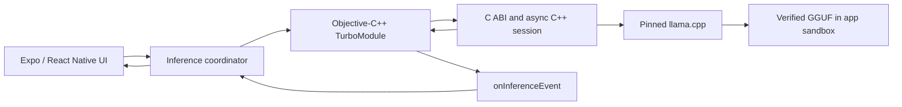

# PocketLM

PocketLM is an experimental iOS application that runs a small language model
locally through a React Native interface, an Objective-C++ TurboModule, and a
C++ `llama.cpp` inference core.

The project focuses on the engineering boundaries around on-device inference:
verified model provisioning, asynchronous token streaming, request
correlation, cancellation, regeneration, and join-before-free teardown.

> [!NOTE]
> PocketLM is a portfolio and systems-engineering project, not a production
> assistant or an App Store release. The tested Simulator configuration uses
> CPU inference. Physical-device Metal behavior has not been validated.

## Highlights

- Runs a pinned Qwen2.5 0.5B Instruct GGUF without a cloud inference service.
- Verifies model revision, byte size, SHA-256, GGUF metadata, and chat-template
  identity before installation.
- Streams request-correlated UTF-8 fragments from a persistent native worker.
- Supports cancellation, regeneration, and awaited model unload.
- Keeps the public native boundary in C while the implementation remains C++17.
- Includes JavaScript, native bridge, C++, sanitizer, concurrency, model, and
  clean-build verification.
- Provides a repeatable Simulator qualification harness for reproducibility,
  encoding, cancellation, memory, and output-quality experiments.

## Architecture



The native session owns the model, context, worker, and at most one accepted
request. Every accepted request receives a session-scoped ID; token and
terminal events carry that identity across the native and JavaScript layers.
Unload cancels active work, joins the worker, frees native state, flushes the
terminal event, and only then resolves.

See [Architecture](docs/ARCHITECTURE.md) and
[Inference Protocol v2](docs/contracts/INFERENCE_PROTOCOL_V2.md) for the
detailed ownership and event contracts.

## Requirements

The checked-in tool versions are intentionally strict:

| Tool | Version |
| --- | --- |
| macOS | Apple silicon development host |
| Xcode | 26.4.1 |
| iOS Simulator | iOS 17.5, iPhone 15 Pro configuration |
| Node.js | 22.23.1 |
| pnpm | 10.34.0 |
| Ruby | 3.4.4 |
| Bundler | 4.0.7 |
| CocoaPods | 1.16.2 |
| CMake | 4.4.0 |
| Ninja | 1.13.2 |

Use a checkout path without spaces for the full iOS release verifier. Allow at
least 8 GiB of free temporary storage in addition to the 491 MB model and
normal Xcode build products.

## Quick start

Clone recursively so the pinned `llama.cpp` submodule is present:

```sh
git clone --recursive https://github.com/ASDFGHJKLZXC123/pocketlm.git PocketLM
cd PocketLM
git submodule status --recursive
```

Install the locked JavaScript, Ruby, and CocoaPods dependencies:

```sh
corepack enable
(cd app && CI=1 corepack pnpm install --frozen-lockfile)
BUNDLE_FROZEN=true bundle install
(cd app/ios && bundle exec pod install --deployment)
```

Download and verify the model. Model bytes are stored in a local cache and are
never committed:

```sh
./scripts/fetch-models.sh
```

Resolve exactly one iPhone 15 Pro on iOS 17.5, then boot it:

```sh
POCKETLM_SIMULATOR_UDID="$(
  xcrun simctl list devices available --json |
  ruby -rjson -e '
    devices = JSON.parse($stdin.read).fetch("devices")
    matches = devices
      .fetch("com.apple.CoreSimulator.SimRuntime.iOS-17-5", [])
      .select { |device|
        device["name"] == "iPhone 15 Pro" &&
          device.fetch("isAvailable", true)
      }
    abort "Expected exactly one available iPhone 15 Pro / iOS 17.5 Simulator" \
      unless matches.length == 1
    puts matches.fetch(0).fetch("udid")
  '
)"

open -a Simulator
xcrun simctl boot "$POCKETLM_SIMULATOR_UDID" 2>/dev/null || true
xcrun simctl bootstatus "$POCKETLM_SIMULATOR_UDID" -b
```

In a second terminal, start Metro from the cloned repository:

```sh
cd PocketLM/app
corepack pnpm start
```

Back in the first terminal, keep the resolved identifier in scope while you
build, install, seed, and relaunch the app:

```sh
(cd app && corepack pnpm exec expo run:ios \
  --device "$POCKETLM_SIMULATOR_UDID" \
  --no-bundler)
./scripts/seed-simulator-model.sh --udid "$POCKETLM_SIMULATOR_UDID"
xcrun simctl launch "$POCKETLM_SIMULATOR_UDID" com.pocketlm.app
```

Open the Models screen to confirm the model is verified, then return to chat.
The first prompt loads the model. Cancel, Regenerate, and Unload exercise the
native request lifecycle.

See [Troubleshooting](docs/TROUBLESHOOTING.md) for model, Simulator, Pods, and
toolchain problems.

## Verification

Fast application and fixture checks:

```sh
./scripts/verify-fast.sh
```

Native Debug/ASan and Release checks:

```sh
./scripts/verify-native.sh all
```

ThreadSanitizer is a separate concurrency lane:

```sh
./scripts/verify-native.sh tsan
```

The model-backed native test requires the downloaded GGUF:

```sh
./scripts/fetch-models.sh
./scripts/verify-m2-model.sh
```

The complete clean-tree macOS verification is:

```sh
./scripts/verify-release.sh all
```

That command validates pinned tools, installs frozen dependencies, runs the
application and native suites, installs locked Pods, and performs a fresh iOS
Simulator build. It does not run the real-model test or ThreadSanitizer.

See [Toolchain and verification](docs/TOOLCHAIN.md) for the exact scope of
each command and [Validation and limitations](docs/VALIDATION.md) for bounded,
environment-specific observations.

## Repository layout

| Path | Purpose |
| --- | --- |
| `app/` | Expo/React Native UI, state, qualification runner, and iOS project |
| `cpp/` | C ABI, asynchronous C++ core, `llama.cpp`, and native tests |
| `models/catalog.json` | Pinned model identity and integrity metadata |
| `scripts/` | Verification, provisioning, and qualification tools |
| `docs/` | Architecture, protocol, validation, and troubleshooting |

## Known limitations

- iOS only; Android is not implemented.
- The validated Simulator path is CPU-only. Physical-device and Metal-offload
  behavior remain untested.
- Model acquisition is host-driven; the app does not download models itself.
- The 0.5B model has limited output quality and should not be used for
  consequential decisions.
- Existing measurements do not support a leak-free claim.
- Sentry is disabled when no DSN is supplied; ingestion and native crash
  symbolication have not been verified.
- Signing, TestFlight, App Store distribution, energy, and thermal behavior
  are outside the current scope.

## Third-party software and licensing

[`llama.cpp`](https://github.com/ggml-org/llama.cpp) is included as a pinned
Git submodule under the MIT license. The
[Qwen2.5 0.5B model](https://huggingface.co/Qwen/Qwen2.5-0.5B-Instruct-GGUF/blob/9217f5db79a29953eb74d5343926648285ec7e67/LICENSE)
is Apache-2.0 licensed, downloaded separately from its upstream source, and not
distributed in this repository.

No open-source license has been selected for PocketLM itself. Public access to
the source does not grant reuse or redistribution rights.
