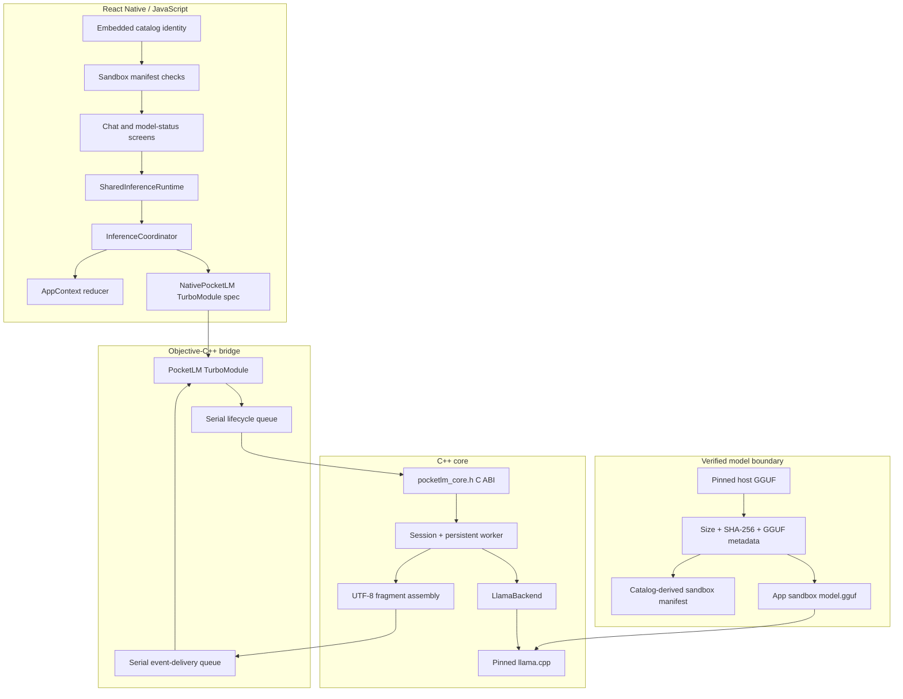
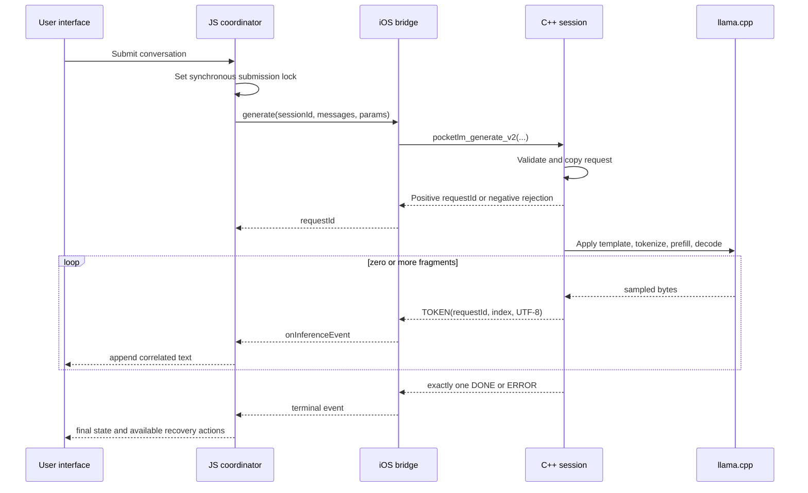
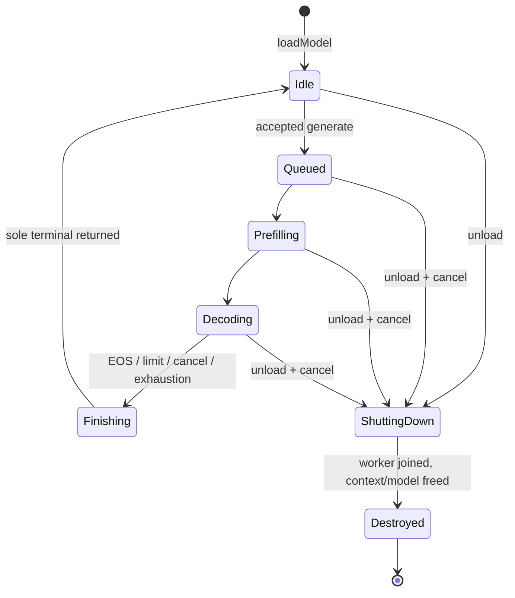

# PocketLM architecture

PocketLM is an iOS-only Expo/React Native application with a C++ inference
core. The implementation deliberately keeps model identity, native ownership,
event delivery, and UI state as separate boundaries.

The normative cross-layer behavior is
[Inference Protocol v2](contracts/INFERENCE_PROTOCOL_V2.md). This document is
an explanatory map, not a second protocol.

## System map

## Component boundaries

| Layer | Main paths | Responsibility |
| --- | --- | --- |
| UI and state | `app/src/app/`, `app/src/state/` | Presents model status, chat turns, cancellation, regeneration, errors, and unload |
| JS coordination | `app/src/features/inference/` | Owns the active `(sessionId, requestId)` tuple, validates events, prevents overlap, and maps native terminals into UI state |
| Native declaration | `app/src/lib/NativePocketLM.ts` | Freezes the TurboModule methods, event name, fields, and numeric result contract |
| iOS bridge | `app/ios/PocketLM/Bridge/` | Owns C handles, lifecycle fencing, payload copying, event coalescing, subscriber gaps, and awaited unload |
| Public native API | `cpp/include/pocketlm_core.h` | Stable C ABI for session creation, asynchronous generation, cancellation, diagnostics, and destruction |
| C++ session | `cpp/src/` | Copies accepted requests, runs one persistent worker, applies chat templates, streams UTF-8, and joins before freeing |
| Model backend | `cpp/src/llama_backend.cpp`, `cpp/third_party/llama.cpp/` | Loads the exact GGUF and performs tokenization, prefill, sampling, and decode |
| Model trust | `models/catalog.json`, `scripts/verify-model.rb`, provisioning scripts | Defines one immutable model and verifies it before atomic Simulator import |

## Request and event flow

An accepted request receives a positive, session-scoped, monotonically
increasing request ID. Every callback carries that exact ID. JavaScript
mutates visible output only when both the session and request IDs match its
active ownership tuple.

Native generation may begin immediately after acceptance. The bridge therefore
copies callback data, defers JavaScript delivery until `generate()` returns,
and emits through the single `onInferenceEvent` channel. TOKEN indices begin
at zero and remain contiguous. A transport gap moves JavaScript into
cancelling state and retains ownership until the matching terminal or awaited
unload.

## Session lifecycle and ownership

Each successful C session owns one model, one inference context, one persistent
worker, and at most one accepted request. A second generation while busy is
rejected synchronously with `-2`; a rejection emits no event.

The iOS lifecycle queue is the owner-side fence around the raw C handle.
Unload marks the session unavailable, cancels accepted work, calls the
join-before-free destroy path, flushes the copied terminal through the delivery
queue, removes the native session ID, and then resolves. No callback may occur
after destroy returns.

The UI keeps an ownership lock through cancellation. It does not report a
request as natively finished or admit overlapping work merely because a local
watchdog or transport error occurred.

## Cancellation boundary

Cancellation is cooperative:

- queued work is woken and cancelled;
- prefill checks cancellation between bounded chunks;
- decode checks cancellation between iterations; and
- the request finishes with one matching `DONE(cancelled)` terminal.

The project measured native-cancel-call to listener-delivery latency, not
touch-to-screen latency. The tested environment was CPU-only. The pinned
llama.cpp abort callback does not establish sub-decode Metal cancellation.

## UTF-8 boundary

The C core emits complete valid UTF-8 transport fragments. It retains an
incomplete suffix between sampled tokens, replaces malformed complete
sequences with U+FFFD, and discards an incomplete tail at terminal.

The bridge may coalesce adjacent fragments without splitting them or crossing
a request boundary. Each JavaScript token event carries the first fragment
index and a `tokenCount`; the coordinator advances its expected index by that
count.

The 100-run stress check covered encoding integrity for emoji, CJK, and RTL
text. It does not establish multilingual semantic quality.

## Model trust and storage

`models/catalog.json` is the sole model identity. It pins:

- repository and immutable revision;
- source and installed filenames;
- exact byte size and SHA-256;
- GGUF version and required tokenizer/chat-template metadata; and
- the app-sandbox directory name.

The host fetch writes to a partial file, verifies it, and atomically renames
it into a cache outside Git. Simulator seeding re-verifies the source,
terminates the app before replacement, copies to a partial sandbox path,
verifies again, applies backup exclusion, writes a catalog-derived manifest,
and atomically renames the final files.

Runtime JavaScript does not derive a path from the host home directory and
does not authenticate 491 MB in Hermes. It accepts only the catalog-derived
manifest, exact byte size, GGUF magic, and chat-template identity produced by
the verified import boundary.

## Backend boundary

The session requests AUTO acceleration. The tested Simulator policy compiles
Metal support but forces inference to CPU. Runtime diagnostics report the
requested and selected accelerator, offloaded layers, and K/Q/V policy;
the UI presents `CPU fallback` rather than claiming Metal.

Physical-device and Metal-offload behavior are outside the tested scope.

## Error and recovery boundary

Synchronous create/generate rejections and asynchronous worker errors remain
distinct:

- invalid input, busy state, shutdown, allocation failure while copying, or
  request-ID exhaustion reject synchronously;
- accepted failures during templating, tokenization, budgeting, prefill,
  sampling, or decode produce exactly one ERROR terminal; and
- cancellation produces DONE with the cancelled finish reason.

The UI exposes retry only after native ownership has ended. Regeneration marks
the prior assistant answer as superseded and starts a fresh request. Unload
awaits native teardown before clearing chat and diagnostics.

## Validation boundary

Architecture and lifecycle tests cover the implemented contracts. Model
quality, cancellation timing, memory observations, and platform limitations
are reported separately in [VALIDATION.md](VALIDATION.md).
