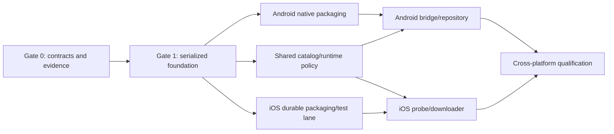

# Expansion Gate 0 orchestration packet

Status: active; G0-A tooling, local capacity, and macOS arm64 package evidence
are accepted; G0-A and feature dispatch remain held at Gate 0.
Original packet date: 2026-08-07.
Updated: 2026-08-23.
Repository basis: `6f9de4a33d08a11ec37258b0d2cab1acab5f61a4`.
Documentation preservation: `3425a50c20f758702316b2c0cb831240ffbdde44`.
G0-A implementation: `2975d61d13903dd3cb5ee8518034427fe9d345be`.
Owning plan: `docs/plans/2026-08-07-ios-android-expansion-implementation-plan.md`.

## Outcome

The expansion will run as an orchestrated program. Gate 1 remains a single
foundation lane because it owns CMake linkage, native-codegen placement, catalog
identity, and the iOS packaging boundary. Android and iOS implementation lanes
may split only after those shared outputs and the Gate 0 contracts are accepted.

No expansion source implementation is authorized by this packet. G0-A added
only a reproducible verification entry point and evidence. Gate 0 is not closed:
physical devices are not connected, the Android generated/prebuild, runtime,
and assigned Linux/KVM lanes are incomplete, and contract/platform fixtures
still need evidence.

Independent review evidence is recorded in
`docs/implementation-logs/GATE_0_INDEPENDENT_REVIEW.md`.
The current repository, verification, model, and platform refresh is recorded
in `docs/implementation-logs/GATE_0_CONSOLIDATION_2026-08-23.md`.

## Model routing

Only the requested model families are allowed for this program.

| Role | Model | Current assignment |
| --- | --- | --- |
| Root orchestrator and contract authority | `gpt-5.6-sol`, high | Dependency graph, freeze decisions, integration, and final evidence audit |
| Contract audit | `gpt-5.6-sol`, high | Completed; no files changed |
| Android readiness audit | `gpt-5.6-terra`, high | Completed; no files changed |
| iOS readiness audit | `gpt-5.6-terra`, high | Completed; no files changed |
| Independent Gate 0 packet review | `gpt-5.6-sol`, high | Completed; no P0/P1 remains and the packet is safe as a hold-only boundary |
| Small bounded follow-up | `gpt-5.3-codex-spark` | Unavailable in this session; leave queued or assign to Terra, never substitute `gpt-5.3-codex` |

Spark is not eligible to own ABI, JNI/Objective-C++ lifetime, storage and
migration, hashing, download recovery, licensing, signing, or gate approval.

## Orchestration topology

The root orchestrator is the only lane that may accept shared-interface changes,
change the dependency graph, or integrate work across platform boundaries.

## Gate 0 decisions

The detailed contract is in
`docs/contracts/EXPANSION_GATE_0_CONTRACTS.md`. The following decisions are
accepted for planning and task-packet preparation:

1. The durable model preference and the active native session are separate.
   A preference never proves that a model is loaded.
2. Model installation, replacement, deletion, repair, and inference share one
   process-lifetime native repository/lease authority per platform.
3. Production model paths are derived and revalidated by native code. Arbitrary
   JavaScript paths remain available only through a separately compiled test
   entry point.
4. Catalog v2, installation record v2, commit marker v1, preference v1, probe
   snapshot v1, manager snapshot v1, and GGUF facts v1 evolve independently.
5. The Inference Event Protocol remains v2. A 2.1 amendment will document
   committed-path validation, leases, publication, and reload reconciliation.
6. iOS uses isolated `iphonesimulator-arm64` and `iphoneos-arm64` native output
   lanes first. An XCFramework may replace them only after both slices and their
   link metadata are reproducible.
7. Android release ships `arm64-v8a` only, with distinct Armv8.0 baseline and
   feature-probed dot-product libraries. `x86_64` is a CI/emulator artifact only.
8. iOS Simulator qualification is available now, but no physical-device Metal,
   background-transfer, or performance claim is permitted without a connected
   iPhone. Android physical and 16 KiB behavior is likewise evidence-gated.
9. Background services remain in the application process for v1.1. A future
   Android remote process or iOS extension would require an OS/file-lock design.
10. Installation replacement promotes a complete staged generation directory.
    The prior active directory is first moved to a same-volume rollback path and
    can be restored after failure or crash; individual model/record/marker files
    are never mixed across publications.
11. The 1.5B artifact identity is pinned provisionally to the official Qwen
    repository at revision `91cad51170dc346986eccefdc2dd33a9da36ead9`, file
    size `1117320736`, and SHA-256
    `6a1a2eb6d15622bf3c96857206351ba97e1af16c30d7a74ee38970e434e9407e`.
    It cannot enter catalog v2 until its complete GGUF facts and license fixture
    are independently verified.

## Platform matrix

### Android target matrix

| Area | Gate 0 decision |
| --- | --- |
| Expo / React Native | Expo 55.0.15 / React Native 0.83.4 |
| App identity | `android.package`, Gradle `applicationId`, and app-module namespace: `com.pocketlm.app` |
| Native identity | Workspace package `@pocketlm/native`; library/Kotlin namespace `com.pocketlm.nativebridge`; existing codegen Java package `com.pocketlm`; TurboModule `PocketLM`; iOS pod `PocketLMNative` |
| Prebuild template | `expo-template-bare-minimum@55.0.27`; exact [tarball](https://registry.npmjs.org/expo-template-bare-minimum/-/expo-template-bare-minimum-55.0.27.tgz); SHA-512 `def044fc7a4d5e55a0e66509f7cdec74d076e3fe7659b28b9c9f5411a3e649fcda997e5910d0bcff1e071d8143c34d6afa27056ae1c7895b47ea716ef02e864e` |
| API levels | `minSdk 24`, `compileSdk 36`, `targetSdk 36` |
| Java | Temurin 17.0.19+10 |
| AGP / Gradle | AGP 8.12.0 / Gradle wrapper 8.13 |
| Gradle distribution | `gradle-8.13-bin.zip`; SHA-256 `20f1b1176237254a6fc204d8434196fa11a4cfb387567519c61556e8710aed78` |
| Kotlin | 2.1.20 |
| SDK | build-tools 36.0.0 and `platforms;android-36` |
| NDK | r28c, package `28.2.13676358` |
| CMake | SDK side-by-side `cmake;3.31.6` |
| Release ABI | `arm64-v8a` only |
| Test ABI | `system-images;android-36;google_apis;x86_64`, revision 7, on a Linux/KVM lane |
| Local arm64 smoke | `system-images;android-36;google_apis;arm64-v8a`, revision 7 |
| 16 KiB | `system-images;android-36;google_apis_ps16k;arm64-v8a` and `x86_64`, revision 7, plus physical proof; verify `PAGE_SIZE=16384`, ELF alignment, and APK zip alignment |
| Physical target | Pixel 8-class device on API 35+ is the recommended target; exact model/build/fingerprint remains open until hardware is supplied |

Android implementation does not start until the pinned SDK packages, NDK, CMake,
and emulator images are installed and physical-phone evidence is recorded.

### iOS target matrix

| Area | Gate 0 decision |
| --- | --- |
| Xcode / Swift | Xcode 26.4.1 (17E202) / Swift 6.3.1 |
| Deployment target | iOS 17.0+ |
| Simulator target | iPhone 15 Pro, iOS 17.5 |
| Native packaging | Fresh, non-overlapping Simulator and device-SDK output directories |
| Test durability | The XCTest target and scheme must survive two clean Expo prebuilds |
| Device compile | Clean `iphoneos-arm64` compile/link is mandatory before Gate 1 closes |
| Physical scope | A connected iOS 17+ arm64 iPhone is required for device load/download/Metal evidence; exact device remains open |

The current pod prepares one fixed Simulator archive tree. It must not be reused
for `iphoneos`, and the current manually maintained XCTest target is not yet a
clean-prebuild proof.

## Dispatch queue

### G0-A — reproducible workspace and toolchain entry point

Owner: root orchestrator. Reviewer: GPT-5.6 Sol.
Status: tooling implementation accepted at `2975d61`; clean fast and iOS
Simulator release acceptance passed. Current local capacity and macOS arm64
package-install evidence also pass. G0-A remains open for assigned Linux/KVM
package-resolution evidence.

Detailed evidence is recorded in
`docs/implementation-logs/GATE_0A_REPRODUCIBLE_WORKSPACE.md`.

Prerequisites:

- owner permission to preserve the approved documentation in Git;
- a short no-space worktree root; and
- adequate disk headroom for Android SDK/NDK/images and model fixtures.

Scope:

- establish the no-space expansion worktree without modifying the existing
  dirty checkout;
- make the pinned Node 22.23.1 and pnpm 10.34.0 entry point explicit; and
- capture exact resolved platform-package revisions.

Exit evidence:

- [x] The nine-document preservation commit has the approved base as its sole
      parent, and the original checkout remained unchanged through G0-A
      acceptance.
- [x] `/Users/f8fq/coding/PocketLM-G0A` passed the no-space predicate with the
      exact clean submodule during the 2026-08-07 acceptance.
- [x] `verify-fast` succeeds from clean implementation commit `2975d61` through
      the pinned entry point.
- [x] `verify-release.sh ios` accepts the clean no-space worktree and completes
      a fresh arm64 Simulator app build.
- [x] The 2026-08-23 11:24 PDT snapshot exceeded both the 40 GiB safety floor
      and 50 GiB preference: 55,615,884 KiB (53.04 GiB) was free.
- [x] Explicit command-line tools 22.0 inventory records the required macOS
      arm64 platform, NDK, CMake, normal image, and 16 KiB image revisions.
- [ ] Record the assigned Linux/KVM normal and 16 KiB x86_64 image revisions;
      macOS Gate evidence uses the deterministic explicit tools 22.0 path.

### G0-B — contract fixtures and ADR acceptance

Owner: GPT-5.6 Sol. Bounded fixture implementation may be delegated to Terra.
Reviewer: a different GPT-5.6 Sol worker.

Scope:

- accept the non-open sections of the Gate 0 contract;
- add golden valid/invalid fixtures for catalog, install record, preference,
  manager snapshot, path, lease, and bounded GGUF cases;
- resolve the policy profile and exact metadata for the 1.5B artifact; and
- record the Protocol 2.1 amendment without changing inference event semantics.

Forbidden changes:

- no codegen relocation;
- no catalog schema activation;
- no JNI/Objective-C++ implementation;
- no downloader; and
- no addition of the second catalog model.

### G0-C — hardware enrollment

Owner: root orchestrator with user-supplied hardware.

Capture for each phone: model, OS/API, build identifier or fingerprint, RAM,
architecture, page size, and available native feature probes. Device identifiers
or serial numbers must not enter the repository.

### G1-A — serialized packaging and codegen foundation

Status: queued; must not start before Gate 0 closes.
Implementer: GPT-5.6 Terra. Designer/reviewer: GPT-5.6 Sol.

The packet will own root static-link policy, Android PIC support, one autolinked
native package/codegen location, minimal Android generation, isolated iOS SDK
packaging, durable XCTest creation, and canonical catalog resource copying. It
must not change inference behavior, catalog cardinality, persistence schema, or
download behavior.

Android clean prebuilds must go through a repository wrapper that downloads or
reuses the exact template tarball only after SHA-512 verification, passes the
local tarball through `--template`, regenerates the wrapper with a verified
Gradle 8.13 distribution, and then verifies the package/namespace, Gradle, AGP,
API, NDK, and CMake values. The Expo `sdk-55` template tag and the template's
bundled Gradle 9.0.0 wrapper are not accepted build inputs.

## Gate 0 exit checklist

- [x] Consolidated implementation plan exists.
- [x] Nine Gate 0 documents preserved in commit `3425a50` without changing the
      original `main` checkout.
- [x] Clean no-space G0-A worktree established with exact recursive submodule.
- [x] GPT-5.6 contract, Android, and iOS audits completed independently.
- [x] Exact Spark selector checked; unavailable and not silently substituted.
- [x] Pinned Node entry point accepted: Node 22.23.1, pnpm 10.34.0, Bash 3.2.57,
      and 13/13 launcher fixtures; clean-commit fast verification passed.
- [x] Independent GPT-5.6 Sol review accepts this packet as a hold-only
      orchestration boundary with no remaining P0/P1 finding.
- [x] Native Debug/Release/ASan baseline recorded by a whole-verifier exit-zero
      rerun: 34/34 Debug/ASan tests, both bridge harnesses, fresh Release compile,
      and both qualification timeout self-tests.
- [x] Native TSan baseline recorded: 22/22 targeted concurrency tests passed.
- [x] Exact cached 0.5B model-backed baseline recorded: SHA/GGUF authentication,
      1/1 required load/generation test with no skip or failure, and the
      mandatory Simulator backend policy check passed on 2026-08-23.
- [x] Clean iOS Simulator app release build recorded from the no-space worktree:
      locked Pods, fresh DerivedData, 115-target generic arm64 build, and clean
      result guard all passed on `2975d61`.
- [ ] Clean iOS XCTest lane survives two clean prebuilds and passes on the named
      iPhone 15 Pro / iOS 17.5 Simulator.
- [ ] Clean iOS device-SDK build recorded from a no-space worktree.
- [x] The recorded local Android installation/build headroom exceeds the 40 GiB
      safety floor and 50 GiB preference.
- [x] Required SDK platform, NDK, CMake, and normal/16 KiB images are installed
      for the macOS arm64 lane; their revisions were recorded using the
      deterministic explicit command-line tools 22.0 path.
- [ ] Assigned Linux/KVM normal/16 KiB x86_64 image revisions are recorded.
- [ ] Exact Expo template and Gradle 8.13 post-prebuild regeneration are
      fixture-verified through two clean Android prebuilds.
- [ ] Android x86_64/API-36 emulator lane runnable.
- [ ] Physical Android phone and physical iPhone named by reproducible facts.
- [ ] Golden contract fixtures and final Gate 0 closure review accepted.
- [ ] No dependent implementation task is blocked on an unnamed state, version,
      path rule, API, or owner.

Until every required item is checked, Gate 0 remains active and feature work is
not dispatched.

## Primary references

- [OpenAI GPT-5.6 model guidance](https://developers.openai.com/api/docs/guides/latest-model)
- [Codex-Spark focused-edit example](https://learn.chatgpt.com/use-cases/make-granular-ui-changes)
- [Expo SDK 55 reference](https://docs.expo.dev/versions/v55.0.0/)
- [Android Gradle Plugin 8.12 compatibility](https://developer.android.com/build/releases/agp-8-12-0-release-notes)
- [Android 16 KiB page-size guidance](https://developer.android.com/guide/practices/page-sizes)
- [Android native ABI guidance](https://developer.android.com/ndk/guides/abis)
- [Qwen2.5 1.5B Instruct GGUF artifact](https://huggingface.co/Qwen/Qwen2.5-1.5B-Instruct-GGUF/blob/91cad51170dc346986eccefdc2dd33a9da36ead9/qwen2.5-1.5b-instruct-q4_k_m.gguf)
