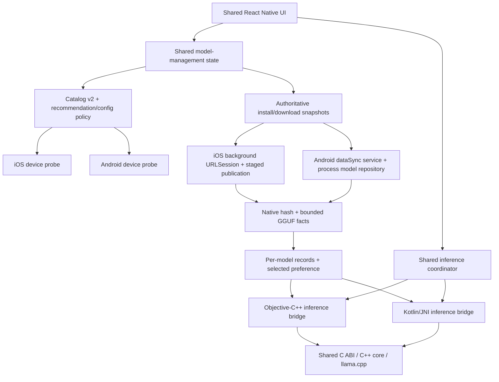
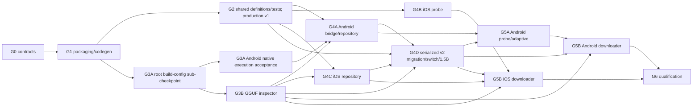

# PocketLM iOS + Android expansion — consolidated implementation plan

Status: revised for Gate 0 orchestration; Claude Opus 5.5 planning review
accepted with nonblocking notes, incorporated/carried into scoped packets;
fresh independent verification accepted. Gate 0B is accepted, but overall
Gate 0 remains open. No expansion feature implementation
or production schema activation has started.
Plan date: 2026-08-07. Revised: 2026-10-03.
Original repository basis: `6f9de4a`. Revision checkpoint: `8e6c4ad` on
`codex/gate-0b-contract-fixtures`.

This plan consolidates and sequences:

- `2026-07-28-android-adaptive-expansion.md` (v3);
- `2026-07-28-android-adaptive-expansion-review.md`;
- `2026-08-03-ios-adaptive-model-selection.md` (v2); and
- `2026-08-03-ios-adaptive-model-selection-review.md`.

The earlier plans and reviews remain historical inputs. This document owns the
cross-platform delivery order and the implementation-agent orchestration policy.

## Executive decision

Build both platforms as one program: a shared catalog, storage, runtime-policy,
verification, and model-management foundation followed by native Android and iOS
lanes. Do not build two independent model-management stacks.

The inherited `../AGENTS.md` governs the implementation workflow: Claude Code
implements code, the lead integrates, and a fresh independent verifier checks
each changed implementation. The former GPT-5.6/Spark-only implementation
allowlist is superseded by that workflow, not applied to Claude. For this plan
revision the user specifically requests a Claude CLI review with
`claude-opus-5-5`; do not silently substitute another model. These are build-agent
assignments, not PocketLM runtime-model restrictions. PocketLM continues to run
catalog-pinned GGUF models locally.

Recommended v1.1 product scope:

- Qwen2.5 Instruct 0.5B and 1.5B Q4_K_M, both fully pinned and Apache-2.0;
- per-device advisory recommendation and user override;
- model-specific context and thread defaults;
- host byte seeding retained for development-build recovery/testing, not as a
  shipped release import route;
- in-app, resumable, verified installation on iOS and Android;
- Android arm64 CPU inference, with x86_64 used only for CI/emulator coverage;
- iOS recommendation accuracy remains advisory even when device-tested; and
- version 1.1 qualification evidence is model- and configuration-specific.

Deferred until after the two-platform release:

- cross-family or research-licensed models;
- Android Vulkan/OpenCL and new iOS Metal-performance claims;
- automatic performance retuning from noisy benchmark samples;
- Play Store, TestFlight, and App Store publication; and
- production-assistant, factual-reliability, or leak-free claims.

## Decisions to freeze before coding

The plan can proceed with the recommended defaults below, but the decisions must
be recorded in an implementation ADR before their dependent work merges.

| Decision | Recommended default |
| --- | --- |
| Android test target | Name one arm64 phone, Android/API version, RAM, CPU features, and page size |
| Android toolchain | Pin exact JDK distribution/version, SDK platform, build-tools, NDK revision, CMake, Gradle wrapper, and AGP; no `r28+`-style ranges |
| Android identities | App `android.package`, `applicationId`, and app-module namespace: `com.pocketlm.app`; native-library Gradle/Kotlin namespace: `com.pocketlm.nativebridge`; preserve codegen Java package `com.pocketlm` |
| Expo native template | `expo-template-bare-minimum@55.0.27` (the release declaring Expo `~55.0.15` and RN `0.83.4`), fetched by exact tarball URL and verified against its published SHA-512 before `prebuild --template`; never resolve the mutable `sdk-55` tag in a gated build |
| Android CPU packaging | Distinct baseline and dot-product JNI artifacts selected by a baseline-native HWCAP probe; retain a debug force-baseline override. If no dot-product-capable physical target is available, ship baseline-only |
| iOS release meaning | Require Simulator qualification plus one physical-iPhone build and probe/download/load smoke; keep recommendation and Metal claims advisory |
| iOS native packaging | Build Simulator and device artifacts in isolated clean SDK lanes or an XCFramework; never reuse the fixed Simulator archive tree for `iphoneos` |
| Model ladder | Apache-only 0.5B + 1.5B for v1.1; no 3B entry |
| Distribution | Development/sideload artifacts only for v1.1 |
| Native model-path contract | Keep the inference path API, but accept only a canonical path issued for a committed installation; reject traversal, symlinks, and arbitrary JavaScript paths outside an explicit test-only injection path |
| Qualification configuration | Use versioned, per-model fixed qualification profiles for comparable evidence; record the exact values actually passed to load/generate, with a separate adaptive-policy smoke |
| Telemetry | No prompts, generated text, local paths, URLs, validators, or resume blobs |
| Sentry | Preserve the current non-claim unless an RC-only ingestion and symbolication test is explicitly funded |

If no physical iPhone is available, label the iOS result "Simulator-qualified
experimental beta" rather than treating background-transfer behavior as fully
validated. Taking that fallback requires an explicit user-approved scope-down
ADR and revised hardware checklist; it is not automatic Gate 0 acceptance.
No such scope change is authorized by this revision, so the current physical
iPhone enrollment requirement remains in force.

## Current baseline

Current checkpoint (2026-10-03): Gate 0B was accepted at `8e6c4ad` with 173
contract cases across 10 families and 30 indexed files. Those fixtures are test
definitions, not production multi-language or device conformance. The dated
August acceptance logs remain historical evidence; the active remaining-work
list is `docs/implementation-logs/GATE_0_ORCHESTRATION.md`.

- The app is explicitly iOS-only in `app/app.config.ts`; there is no Android
  project, Android bridge, Android CI, or Android model collector.
- The C++17 core and C ABI are reusable, but root CMake does not yet force static
  llama linkage or Android position-independent archives and has no GGUF
  inspection API.
- The Objective-C++ inference bridge already implements the strongest reusable
  lifecycle design: serialized ownership, a dedicated teardown queue, serialized
  delivery, strict request correlation, and join-before-free destruction.
- The model catalog and TypeScript/Ruby validators require exactly one model.
  Manifest schema 1 stores global selection inside the single installation
  record.
- The inference coordinator hardcodes `contextSize: 2048` and `nThreads: 0` and
  does not key a live session by a model/configuration fingerprint.
- Model acquisition and full authentication are host-driven. There is no device
  probe, in-app downloader, native catalog reader, process-lifetime model
  repository, or startup repair pass.
- The iOS pod and release verifier are Simulator-focused. The release verifier
  builds but does not run an iOS XCTest lane.
- The current checkout path contains spaces, while the iOS release verifier
  rejects such a path. Implementation worktrees must live under a no-space
  parent before release verification begins.
- The accepted no-space G0-A worktree is now absent/prunable. The 2026-10-03
  disk snapshot is 12,770,476 KiB (12.18 GiB), above the current iOS verifier's
  default 8 GiB threshold but below the Android 40 GiB safety floor / 50 GiB
  preference. Recreate an isolated no-space worktree and recheck capacity before
  dispatch; no cleanup or build is authorized by this documentation revision.
- Gate 1 includes Android generation and uses the 40 GiB floor / 50 GiB
  preference on each assigned Android build runner. A separately assigned iOS
  lane may use its verifier's 8 GiB minimum, but that does not satisfy Android
  readiness or close the joint foundation gate on this host.

## Target architecture



The inference event protocol remains unchanged. Device probes and model
management use sibling native modules so download state and platform capability
do not expand the frozen inference module unnecessarily.

## Delivery order and gates

### Gate 0 — baseline, scope, and contract freeze (4–7 days)

Normative controls:

- `docs/implementation-logs/GATE_0_ORCHESTRATION.md`;
- `docs/contracts/EXPANSION_GATE_0_CONTRACTS.md`;
- `docs/contracts/EXPANSION_GATE_0_DECISIONS.md`; and
- `docs/contracts/INFERENCE_PROTOCOL_V2.md` (Protocol 2.1 amendment).

Historical acceptance and current checkpoint evidence:

- `docs/implementation-logs/GATE_0_BASELINE.md`;
- `docs/implementation-logs/GATE_0A_REPRODUCIBLE_WORKSPACE.md`;
- `docs/implementation-logs/GATE_0_CONSOLIDATION_2026-08-23.md`;
- `docs/implementation-logs/GATE_0B_CONTRACT_FIXTURES_2026-08-23.md`;
- `docs/implementation-logs/GATE_0_INDEPENDENT_REVIEW.md`; and
- `docs/implementation-logs/plan-revision/2026-10-03-lead-plan-reconciliation.md`
  plus its Claude and independent-verifier review records.

Deliverables:

- commit the approved plan and its reviewed ADRs;
- create no-space implementation worktrees;
- capture the existing fast, native Debug/Release/ASan, TSan, bridge-harness,
  model-backed, and clean iOS build results;
- freeze the exact Android toolchain/device matrix and the iOS qualification
  scope;
- freeze catalog v2, installation-record v2, selected-preference, download
  snapshot, model/config fingerprint, and mutation-state schemas;
- freeze separate selection semantics: `selectedPreference` is durable user
  intent and never implies a loaded session; `activeFingerprint` is runtime-only
  and exists only after successful native load;
- freeze the platform-native model-lease contract: inference holds a read lease
  on its canonical installed path, while publish/delete/replace requires an
  exclusive lease that cannot be lost by a React reload;
- define native module APIs for probe and model management, including stable
  error/state enums;
- record the protocol amendment and ABI-versioning rules;
- name the development seeding route: a compiled dev/test-only transport seam
  for the existing `startInstall` flow, owned by Gates 4A/4C; host scripts deliver
  bytes only. It adds no public manager method, schema, receipt, or inference ABI;
- preflight the implementation/review assignments under the inherited workflow
  without silently substituting an unavailable requested model; and
- choose the iOS Simulator/device packaging mechanism and make qualification
  profile authority explicit.

Exit gate:

- every baseline result is recorded, with pre-existing failures explicitly
  separated from expansion work;
- schemas have accepted golden valid/invalid fixtures and ownership/lifetime
  notes (Gate 0B complete);
- exact Android/iOS hardware facts and assigned Linux/KVM normal/16 KiB API-36
  x86_64 image revision-7 installation evidence are recorded;
- a final overall Gate 0 closure review accepts the remaining-work list; and
- no implementation task is blocked on an unnamed device, version, state, or
  API contract.

Gate 0 freezes inputs and records existing gaps. It does not require the new
prebuild wrapper, durable XCTest target, or isolated device-SDK lane that Gate 1
creates. Android emulator/native execution belongs to Gates 3A/4A; final
physical/background-transfer qualification belongs to Gate 6. These later
proofs remain mandatory at their owning gates, not prerequisites for creating
the foundations. Current workspace/capacity/tool availability is a separate
dispatch preflight, never satisfied permanently by a historical PASS.

### Gate 1 — packaging and codegen foundation (1.5–2.5 weeks)

This is serialized work with one owner.

Deliverables:

- before foundation code changes, record inherited-workflow applicability and
  prepare project-local `AGENTS.md` plus `.env.example`/environment inventory:
  structure, commands, style, tests, security and workflow; enumerate existing
  `EXPO_PUBLIC_SENTRY_DSN`, `EXPO_PUBLIC_SENTRY_ENV`, and
  `EXPO_PUBLIC_POCKETLM_RC_COMMIT` without real secrets. This existing-project
  documentation task does not retrospectively relabel August acceptance or
  exempt any future code pass from Claude/independent verification;
- force `BUILD_SHARED_LIBS=OFF` at root CMake and keep all current host/iOS
  suites green;
- enable explicit position-independent static archives for Android JNI linkage
  and force unused GPU/BLAS backends off for Android;
- move `NativePocketLM.ts` and `codegenConfig` into one local autolinked native
  workspace package named `@pocketlm/native`; retain an app-level re-export
  shim, the TurboModule name `PocketLM`, codegen Java package `com.pocketlm`, and
  iOS pod name `PocketLMNative`; use `com.pocketlm.nativebridge` for the Android
  library/Kotlin implementation namespace;
- add minimal Android app/config and local-package scaffolding sufficient to run
  Android prebuild/codegen, while deferring the real Kotlin module to Gate 4A;
- add one repository prebuild entry point that verifies the pinned Expo template,
  passes it explicitly to `expo prebuild`, reapplies the Gradle 8.13 distribution
  and checksum from a verified Gradle 8.13 tool, and asserts the API/NDK/CMake,
  package/namespace, and ABI pins after every clean generation;
- preserve the current iOS pod and generated `PocketLMSpec` contract, and add a
  clean `iphoneos` packaging/build lane using the Gate 0 mechanism;
- add a prebuild-safe generic XCTest target/scheme that runs the existing bridge
  harness wrapper and survives two clean prebuilds; Gate 4B extends this lane
  with probe-specific integration tests rather than recreating it;
- create homes for the sibling probe and model-manager specs; Gate 2 owns their
  shared model-manager definitions before any platform implementation; and
- add build-time canonical catalog copying/digest checks so JavaScript, Ruby,
  Objective-C++, and Kotlin all consume identity derived from
  `models/catalog.json`.

Exit gate:

- two consecutive clean iOS and Android prebuilds produce exactly one generated
  inference spec; iOS still registers exactly one working `PocketLM`, while
  Android registration remains an explicit Gate 4A exit condition;
- both Android generations use the exact template tarball and reproduce Gradle
  8.13, NDK `28.2.13676358`, SDK CMake `3.31.6`, API 36, and
  `com.pocketlm.app` without manual edits;
- the stock/generated `AppDelegate.swift` remains unchanged;
- the iOS bridge harness, `xcodebuild test` on the durable generic XCTest lane,
  clean Simulator build, and clean device-SDK build pass without sharing
  SDK-specific native outputs; and
- native catalog resources are byte/schema checked against the repository
  source of truth.

### Gate 2 — shared multi-model and runtime preparation (2–2.5 weeks)

Land N-entry/dual readers, definitions, and deterministic tests while the
production catalog and storage remain schema 1 with the existing 0.5B model.
Gate 4D, not this gate, owns production activation after native foundations.

Deliverables:

- catalog-v2 readers/validation with uniqueness and safe-path checks for IDs,
  directories, source filenames, and installed paths;
- immutable per-model installation records plus a separate selected-model
  preference;
- migration planning and deterministic journal/crash-prefix tests preserving
  the existing 0.5B installation without redownload, against fake native
  authority; no production migration or durable preference mutation yet;
- deterministic fallback for missing, invalid, deleted, or unknown selections;
- model-ID addressing definitions in Ruby/fetch and the future Simulator/Android
  host-delivery interfaces; Gates 4A/4C own their actual safe seeding routes;
- pure shared recommendation/runtime-config policy with byte units, caps,
  boundary vectors, manual-override persistence definitions/tests, and safe
  missing-probe fallback;
- one owner for the shared probe/model-manager TurboModule specs and authoritative
  snapshot/receipt/error definitions, including canonical command identity,
  durable replay, manager revisions, and quarantine/publication target identity;
- the Gate 2 Claude implementer as the single shared test-data owner for generated
  small two-entry catalogs/GGUF recipes
  under the future `fixtures/expansion-implementation/` location, outside the
  closed Gate 0B `fixture-set-v1` inventory. Platform test builds use isolated
  native test-only repository roots; they never reuse production generations or
  invent production publication IDs. Real-model bytes remain outside Git;
- model/config fingerprint definitions against fake-authority fixture
  publications, not production inference ownership. Never manufacture a
  publication ID for an existing schema-1 installation;
- a shared switch-controller definition/test adapter that will be a client of
  platform-native lease authority at Gate 4D, with these tested transitions:
  - idle selection commits `selectedPreference` after a durable verified install
    and leaves `activeFingerprint` null;
  - active switching stops admission → cancel/terminal delivery → awaited unload
    → internal staged load → durable preference/fsync → expose active fingerprint;
    the staged session accepts no inference before preference durability;
  - installing an unselected model publishes only its installation record;
  - failed new load keeps the old preference, attempts to reload the old
    fingerprint, and otherwise enters an explicit unloaded error state;
  - preference-write/fsync failure unloads the staged desired session before
    old-fingerprint recovery; failed staged unload retains its lease/session as
    a process-global fault blocker rather than allowing inference or mutation;
  - full React/JavaScript reload enumerates and unloads orphan sessions before
    mutation readiness; and
- per-model bench and qualification identity.

All migration, preference, and switch tests in this gate use fake authority.
They do not prove native exclusion, filesystem durability, or crash repair.
The accepted Gate 0B contract and corpus are normative; do not introduce a
second abbreviated state machine in an implementation packet.

Exit gate:

- TypeScript/Ruby dual readers and shared spec/snapshot fixtures agree with the
  accepted corpus, while production defaults remain schema 1;
- deterministic migration tests are idempotent and preserve an authentic
  schema-1 fixture; native readers/writers and real migration are later proof;
- model/context changes cannot leave two app-owned sessions resident at the JS
  policy layer; native/reload-proof exclusion is accepted only at the later
  platform lease gates;
- failed unload retains old ownership, while failed new load does not publish a
  false `activeFingerprint` and exercises the rollback/error path;
- fake-authority adapters receive the correct model path, context, accelerator,
  GPU layers, and thread count; Gate 4D proves the actual native calls; and
- all existing iOS and shared suites remain green.

### Gate 3A — Android native toolchain and CPU packaging (3–5 days)

May overlap Gate 2 after Gate 1 is accepted.
Record a separately reviewed root-build-configuration sub-checkpoint before
Gate 3B touches shared CMake. Gate 3B can proceed after that merge without
waiting for Gate 3A's KVM/phone execution acceptance; Gate 4A still waits for
the complete Gate 3A gate.
The sub-checkpoint is a code change, accepted only after its Claude implementation
and fresh verifier logs name/pass the affected host Debug/Release/header tests,
both Android ABI/variant cross-compiles, PIC/static/dynamic-closure and 16 KiB
ELF checks, and existing shared/iOS regressions. The Gate 3A task packet names
exact commands before dispatch; KVM/phone execution stays at the full exit.

Deliverables:

- exact Android/JDK/SDK/NDK/Gradle/AGP pins and dependency verification;
- x86_64 CI/emulator build plus arm64-v8a release builds;
- arm64 baseline and dot-product artifacts with explicit filenames/SONAMEs;
- a tiny baseline-native `getauxval(AT_HWCAP)`/`HWCAP_ASIMDDP` selector, never
  a `/proc/cpuinfo` guess;
- PIC/static-link and approved dynamic-dependency closure checks;
- Android-native smoke/test runner; and
- 16 KB ELF alignment checks where a loadable ELF exists.

Exit gate:

- x86_64 smoke runs on a KVM-backed AVD;
- baseline arm64 smoke runs on the chosen phone;
- optimized smoke is required on dot-product-capable physical hardware after
  HWCAP confirmation; if that target is unavailable, omit the optimized artifact
  from the release instead of shipping it unexecuted;
- forced-baseline mode works; and
- no Metal, Vulkan, OpenCL, or unintended BLAS backend is compiled.

Gate 3A defines the packaged-runtime assertions; Gate 4A must later prove that
both arm64 libraries coexist in the APK, neither is eagerly loaded through
autolinking/SoLoader, exactly one variant registers JNI, unsupported hardware
cannot select dot-product code, and the force-baseline override uses the same
production registration path.

### Gate 3B — shared native GGUF inspector (3–5 days)

Gate 3A's root-build-configuration sub-checkpoint must land first because both
touch shared native build files. Serialize those edits, not the entire hardware
qualification tail. Gate 3B may overlap the tail of Gate 2 and the remaining Gate 3A device
proof, but must be accepted before either platform adapter consumes the new ABI.

Deliverables:

- the accepted append-only C ABI 2.2.0 / `0x00020200` inspector returning
  bounded GGUF facts-v1 rather than
  accepting a path with unknowable catalog expectations;
- explicit output struct size/version, buffer ownership, truncation, overflow,
  invalid UTF-8, and maximum-template semantics;
- catalog-agnostic golden inspection facts that platform adapters will compare
  with their bundled selected entry; and
- C/C++ header-compile and hostile fixture coverage.

Retain existing ABI 2.1 inference symbols/structures unchanged. Facts-v1 accepts
GGUF wire version 3 only; reject versions 1/2/4 before metadata interpretation.
Parser success and the platform's catalog/model/template comparison are separate
checks, including parser-success empty-template followed by mismatch rejection.

Exit gate:

- valid, truncated, corrupt, oversized-metadata, and structurally valid but
  wrong-metadata/chat-template GGUFs are distinguished correctly;
- verification does not require constructing a model session; and
- Debug/ASan, Release, and applicable concurrency lanes remain green.

### Gate 4A — Android bridge and deterministic provisioning (3–4 weeks)

Starts after Gates 1/2, complete Gate 3A, and Gate 3B acceptance. Re-estimate the
packet before dispatch: the displayed range is historical, and this revision
makes repository scope explicit rather than claiming a fresh duration.

This is a Claude Code-owned critical-path milestone with a fresh independent
native/concurrency verifier.

Deliverables:

- Kotlin TurboModule plus JNI adapter matching Inference Protocol v2;
- three execution contexts: lifecycle owner thread, dedicated blocking teardown
  executor, and serialized event-delivery executor;
- JavaVM attach/detach policy, global-reference lifetime, pending-exception
  checks, and React-context invalidation rules;
- strict UTF-16↔UTF-8 conversion for prompts, paths, error strings, and token
  bytes; reject lone surrogates and embedded NULs;
- canonical native resolution of internal
  `filesDir/PocketLM/Models/<appDirectoryName>` paths;
- a process-lifetime Kotlin `ModelRepository`/lease authority shared by
  inference, staged installation, selection, deletion, and startup repair;
- schema-1 compatibility readers and schema-2 writers, migration-fixture/startup
  repair, native hash/GGUF/catalog validation, durable preference/receipt handling,
  and committed
  path admission, implemented without production v2 activation;
- Kotlin comparison of Gate 3B's bounded facts with the canonical bundled
  catalog, including wrong-model and oversized-field cases;
- a portable ABI-level bridge fake and CheckJNI instrumented harness;
- Android app configuration, no-credentials Sentry behavior, and backup rules;
- minimal deterministic fixture seeding followed by a hardened
  `seed-android-model.sh`, using the development route below; and
- debug APK per-`.so` and `zipalign -c -P 16 -v 4` gates.

Exit gate includes rejection/no-event semantics, token contiguity/coalescing,
emoji in prompts and output, malformed input, cancel in every phase,
terminal-before-unload-resolution, no callback after destroy, module reload,
and one session progressing while another teardown blocks. It also requires:

- two clean Android prebuilds with exactly one registered `PocketLM` module;
- both arm64 variants packaged, neither eagerly loaded, exactly one registered
  at runtime, HWCAP-safe normal dot-product selection plus production-path
  force-baseline coverage on the same capable device (or a proven baseline-only
  release when no optimized artifact ships);
- traversal, symlink, arbitrary-JavaScript-path, and uncommitted-install path
  rejection outside an explicit test-only injection route;
- pending per-model admission promoted without an exclusion gap to a read lease
  bound to model/publication/opened-file identity, released only after native
  destruction; failed unload and orphan reload remain fenced;
- deterministic native migration/repair/receipt conformance against the Gate 0B
  corpus, including raw-byte authentication and crash/failure prefixes; and
- fixture-seeded chat, cancel, regenerate, and unload on the named arm64 phone
  before production activation or downloader work starts. Fixture seeding uses
  an explicitly test-only route; it is not a second production storage writer.

Android has no legacy production installation. It never writes production
schema 1: pre-activation v2 foundation tests use a compiled test-only catalog;
Gate 4D performs a fresh production v2 bootstrap. Migration conformance uses
authentic schema-1 fixture inputs, not an invented Android upgrade history.
An Android build with bundled production catalog schema 1 fails closed as
`CATALOG_UNSUPPORTED`. Gate 4A's phone chat uses a dev/test build embedding a
one-entry v2 catalog with the exact real 0.5B identity and an isolated test root.

Development seeding route (shared design, implemented separately in 4A/4C):

- compile a dev/test-only local-file transport seam beneath the existing
  `startInstall` command; do not add a public `ManagerMethod` or new persisted
  schema/receipt shape;
- host scripts copy validated source bytes into a private import inbox and
  trigger the unchanged command through test tooling; they never write active,
  staging-generation, rollback, preference, receipt, or commit files;
- native code creates the normal receipt and authorizing transfer intent using
  the selected catalog's frozen URL/size/hash identity, then follows the normal
  staged hash/GGUF/protection/fsync/publication path under repository authority;
- the transport seam can only supply bytes; it cannot bypass validation,
  startup repair, lease conflicts, durable intent, or publication ordering;
- shipped release builds contain no local-file override or arbitrary-path entry
  point. This remains a development/recovery/test route, not a public downloader;
  and
- test small corpus generations and exact pinned real-model bytes through this
  route before Gate 4D switching tests. Real network/resume behavior is Gate 5B.

Required 4A/4C packet details before implementation: native-derived import inbox
outside the fixed production Models layout; permissions/protection/backup
exclusion and cleanup; disk preflight counting inbox plus complete staged copy;
compiled transport selector/test trigger; mapping local failures to the closed
manager error enum; and crash repair for interrupted local delivery/transfer.
These are packet-level freezes under the existing private test seam, not new
public manager methods. Overall owner/API readiness cannot be checked off while
those details are unnamed.

### Gate 4B — iOS probe and Simulator integration (5–8 days)

May run in parallel with Gate 4A after Gate 1 codegen ownership is stable and
Gate 2's policy contract is frozen.

Deliverables:

- sibling `PocketLMDeviceProbe` TurboModule exposing physical and available
  memory, processor counts, free disk, and `isSimulator`;
- `availableMemoryBytes == 0` means unknown, with advisory physical-memory
  fallback;
- no model choice is hidden or blocked by the advisory probe;
- injected pure-policy tests plus probe integration tests added to Gate 1's
  durable iOS Simulator XCTest target/lane;
- model-aware benchmark attribution; and
- validation copy that does not turn Simulator host memory into a device claim.

Exit gate:

- actual Simulator integration proves `isSimulator == true` and exercises the
  zero/unknown path;
- two clean prebuilds followed by `xcodebuild test` prove the extended test lane
  remains durable;
- absent/malformed probe data fails safely;
- policy boundary vectors pass; and
- the resolved session configuration reaches `loadModel`.

### Gate 4C — iOS native repository foundation

Estimate: redistributed from the former Gate 5B storage/lease allocation;
packet-level estimate required before dispatch, not a new calendar commitment.

This moves the storage/lease prerequisite out of the downloader milestone; it
does not add a second storage design. Starts after Gate 2 shared definitions and
Gate 3B inspector acceptance. Serialize changes to the existing iOS inference
bridge with other iOS work, including Gate 4B integration.

Deliverables:

- one process-lifetime Objective-C++ repository/lease authority shared by
  inference, selection, publication, deletion, and startup repair;
- schema-1 compatibility readers and schema-2 writers, native hash/GGUF/catalog
  comparison, migration journal, durable preference/receipt handling, and startup repair;
- native-derived canonical committed paths, pending load admission and opened-
  file identity-bound leases, join-before-free release, and orphan reconciliation;
- protection/permissions/backup exclusion for generations and repair metadata;
- deterministic native fixture, preference-failure, receipt replay, quarantine,
  and migration/publication crash-prefix tests;
- the development seeding route specified in Gate 4A, with Simulator host
  scripts limited to byte delivery instead of direct active-directory writes; and
- bridge integration behind the Gate 4D activation boundary. Until that checkpoint,
  preserve the existing schema-1 production baseline and use explicit test-only
  injection for v2 foundation tests.

Keep the existing `seed-simulator-model.sh` unchanged for authentic schema-1
setup until activation. Afterwards retain its legacy generation behavior only
as an offline migration-test input generator in an isolated legacy test sandbox;
never let it write migrated/production v2 active directories. Real legacy
migration evidence is Simulator-based because that is the historical install
lane; physical iPhone qualification uses fresh v2 bootstrap, not fabricated
device-upgrade history.

The bundled production catalog's `schemaVersion` is the activation boundary;
there is no separately mutable runtime feature flag. Fixture catalogs and
transport/ABI fakes are compiled test-only seams, never production enablement.

Exit gate:

- native readers/writers and adapters conform to the accepted corpus; Ruby
  fixture verification alone does not satisfy this requirement;
- writers cannot race loading/loaded sessions; failed unload retains ownership;
- traversal, symlinks, arbitrary JavaScript paths, and uncommitted generation
  paths reject through the actual iOS bridge outside a compiled test-only route;
- repair/hash/inspection/path/protection checks fail closed before readiness;
- Simulator file-protection checks prove configured attributes only; actual
  locked-device Data Protection behavior remains physical-device Gate 6 proof;
- durable command identity/replay and exact publication-versus-quarantine delete
  targeting are proved without an in-app download engine; and
- existing iOS lifecycle/build suites stay green; no production schema or second
  model activation occurs in this gate.

Both Gate 4A and Gate 4C require a release-negative check: release compile/link
inputs and packaged artifacts exclude the local-file transport seam, fixture
catalogs/test-root override, inference ABI fake and fault-injection hooks.
Release runtime cannot select those routes. Record exact artifact/configuration
checks and runtime rejection proof in each platform packet.

### Gate 4D — serialized production activation and switching

Estimate: redistributed from Gate 2's former production activation allocation;
packet-level estimate required before dispatch.

This is the production portion formerly implied by Gate 2. One owner integrates
after Gate 2, Gate 3B, Gate 4A, and Gate 4C are accepted. Both native consumers
must pass before changing the shared production catalog. The new checkpoints
redistribute existing migration/repository work rather than widen product scope.

Required order:

1. Prove TypeScript, Ruby, Kotlin, and Objective-C++ v2 readers/writers/adapters
   against their relevant accepted fixtures, with native mutation authority,
   committed-path leases, startup repair, hash/GGUF checks, and compatible ABI.
2. Activate catalog v2 with the existing 0.5B model only. iOS performs real,
   idempotent schema-1 migration under exclusive native authority; Android
   performs a fresh v2 bootstrap and passes authentic migration-fixture
   conformance without a production schema-1 writer. On an iOS fresh install,
   also exercise bootstrap. Keep authentic legacy bytes reproducible on test
   devices; an already migrated install is not downgraded to fabricate evidence.
3. Integrate and accept durable preferences, fingerprints, and native switching:
   internal desired load → preference/fsync → expose active, including failed
   load, failed preference, failed unload, and React reload/orphan recovery.
   The pre-1.5B validation vehicle is a compiled test-only two-entry catalog with
   complete validated small GGUF fixture generations and an ABI-level bridge
   fake for deterministic load/unload failure scheduling. Repository, filesystem,
   lease, receipt and preference code are real native implementations, not fake
   authority. Fixture identities never enter the bundled production catalog.
4. Only after those checks are green, add the authenticated 1.5B production
   entry and prove both model IDs/configurations reach the actual native calls.
   Seed exact authenticated 0.5B/1.5B bytes through the 4A/4C dev route and rerun
   a named real-core subset on both platforms: 0.5B→1.5B→0.5B, cancel/terminal
   before unload, durable preference/active identity, injected preference-fsync
   failure recovery, and React reload/orphan-unload fencing. Report test-fake
   and real-core evidence separately; no fake alone proves actual model switching.
   Execution lanes: Android's enrolled arm64 phone and the named iOS Simulator,
   in isolated dev/test roots. Signed physical iPhone/background-transfer proof
   remains Gate 6, not implied by this subset.
   This is feature activation, not final physical performance/release qualification.

Exit gate: real iOS migration preserves the prior 0.5B bytes without redownload;
Android fresh bootstrap and native migration-fixture conformance pass;
crash/failure prefixes are recoverable or explicitly fail closed; no false active
session or double-load is exposed; selected preference is durable before active
publication; production host/Simulator/Android seeding cannot bypass the native
repository and must produce a complete validated generation under exclusive
authority and through the compiled dev/test-only route. Downloaders remain
unimplemented until this activation gate is accepted.

### Gate 5A — Android probe and adaptive integration (1–1.5 weeks)

Starts after Gate 4D accepts the production repository and shared switch flow.
Reuse that accepted switch matrix with actual probe-driven configurations;
this gate adds adaptive integration rather than re-owning baseline switching.

Deliverables:

- a platform probe for total RAM, low-RAM classification, CPU topology, and
  documented fallbacks when cpufreq facts are missing/zero/offline;
- integration with Gate 4A's process-lifetime repository, with an explicit
  in-process service policy or OS/file lock if a separate process is ever
  introduced; and
- shared policy and switch-controller integration.

Exit gate:

- recommendation boundaries and manual overrides pass deterministically;
- model/context switching is serialized and never double-loads;
- provider/React reload cannot lose the native mutation authority; and
- the named phone reports plausible RAM, low-RAM classification, HWCAP,
  topology/fallback, and resulting model/thread/context recommendation before
  thresholds are described as qualified.

### Gate 5B — parallel platform download engines

Estimate: 2–3 calendar weeks with two senior owners; 4–6 engineer-weeks.

Both implementations conform to one shared snapshot/state contract. Progress
events are hints; snapshots are authoritative. Gate 4D must be accepted first;
Android also requires Gate 5A, and iOS requires Gate 4B. These engines consume the
accepted native repositories, not create their first mutation authority here.

Android deliverables:

- foreground `dataSync` service after revalidating the frozen API matrix,
  including merged-manifest checks for both foreground-service permissions and
  service type, visible-state start restrictions, timely `startForeground`,
  Android 13 notification-denied behavior, and Android 15 timeout/quota paths;
- exact `Range`/`If-Range` behavior for 206, ignored-range 200, 416, shifted
  ranges, validator changes, and stale/corrupt partials;
- persisted start/pause/resume/cancel/delete/snapshot states, stable errors,
  exact command receipts/revisions, durable replay, and publication/quarantine
  delete-target identity from the accepted shared manager contract;
- closed-file hash and native metadata inspection;
- repository-fenced publication and deletion; and
- notification-denied, forced-timeout, Doze, service restart, React reload, and
  process-death tests.

iOS deliverables:

- background `URLSession` with a stable identifier and opaque
  `resumeData`-primary recovery;
- durable model identity, original pinned URL, validators, expected size/hash,
  resume blob, state, and errors—but no invented owned partial length;
- clean restart on invalid resume data, validator mismatch, 416, or expired
  signed-redirect 403;
- prebuild-safe `ExpoAppDelegateSubscriber` handoff with exactly-once completion;
- streamed native CommonCrypto hash and native catalog comparison;
- Objective-C++ adapter rejection coverage for wrong model identity,
  metadata/template mismatch, oversized/truncated facts, and catalog-version
  drift;
- integration with Gate 4C's process-lifetime repository and inference leases;
  download work never replaces or bypasses that accepted authority;
- an `awaitingPublication` state: background work may stage/hash/verify, but
  final promotion waits for foreground cancel + awaited unload instead of
  racing the inference bridge; and
- explicit pause via cancel-producing-resume-data, distinct permanent cancel
  that discards resume/staging state, idempotent repeated pause/resume/cancel,
  missing-resume-data recovery, and relaunch-after-cancel behavior;
- documented file-protection class, restrictive permissions, backup exclusion,
  and cleanup for resume blobs, snapshots, validators/redirect data, and staged
  GGUFs—not only the final installed model; and
- explicit tests for suspension, OS termination/relaunch, and ordinary
  relaunch; no unverified claim about continuation after user force-quit.

Shared durable-publication requirements:

This directory-generation protocol supersedes any file-by-file promotion
sequence in the historical Android or iOS input plans.

1. build one complete operation-scoped generation directory under the native
   same-volume staging root;
2. write/close/hash/inspect/fsync `model.gguf` there;
3. apply and verify restrictive permissions plus the platform file-protection
   and backup-exclusion policy before the record may assert exclusion;
4. write/fsync/rename `manifest.json` inside that staging generation;
5. write/fsync/rename `commit.json` last, then fsync the staging generation and
   its parents;
6. prepare/fsync an empty model-specific rollback parent and reject promotion if
   an unresolved rollback already exists;
7. request platform mutation authority; if blocked by session IDs, return
   `MODEL_IN_USE`, complete cancel + awaited unload outside exclusive authority,
   then retry. Never call or await unload while holding an exclusive lease;
8. when replacing, atomically rename the entire current active generation to its
   publication-ID rollback path and fsync both parents;
9. atomically rename the entire complete staged generation to the fixed active
   model-directory path and fsync the model root;
10. reopen and revalidate identity, record/marker, permissions, protection, and
    backup exclusion, then expose the committed snapshot; individual model,
    manifest, and marker files are never promoted independently;
11. if rename, post-rename fsync, or revalidation fails, atomically quarantine
    the candidate active directory and fsync its parents, then restore/fsync the
    rollback generation before returning failure; with no prior generation the
    model remains missing. After a crash, repair restores a lone valid rollback,
    retains a valid promoted active generation, and fails closed on ambiguity;
12. retire rollback only after the new active generation is durably visible and
    revalidated;
13. during an active-session switch, keep a successfully loaded desired session
    internal, durably commit/fsync selected preference, and only then expose its
    active fingerprint. Preference failure unloads that staged session before
    recovery; failed staged unload retains the process-global fault blocker.
    With no live session,
    preference may commit after durability but must not claim the model is
    loaded; and
14. run startup repair against every staged/active/rollback crash prefix before
    model-manager mutation becomes ready.

Exit gate:

- unverified/partial files are never loadable;
- kill-at-staging, active-to-rollback, and staging-to-active windows repair
  deterministically without mixing publications or losing the prior committed
  generation;
- delete/replace cannot race a loaded or loading session;
- background completion or React reload cannot bypass either platform's live
  model lease and publish over a loaded model;
- the production iOS bridge rejects traversal, symlinks, arbitrary JavaScript
  paths, and uncommitted installations while retaining an explicit test-only
  injection route;
- insufficient-space and all documented resume cases fail closed;
- iOS backup-exclusion `check` passes against an app-downloaded install;
- protected transient iOS download state is also excluded/cleaned as specified;
- both engines preserve durable receipt/replay identity and exact deletion
  targets across restart, and successful repair/replacement performs the
  contract's mandatory quarantine cleanup before readiness; and
- an Android compliance test covers every manifest/runtime foreground-service
  rule in the frozen API matrix.

### Gate 6 — product integration and cross-platform qualification (1–2 weeks)

Deliverables:

- models screen for recommendation, override, per-model status, download,
  pause/resume/cancel, delete, disk use, and warnings, including `Retry install`
  and `Delete damaged files` for quarantine-only invalid installations;
- selected model/config identity in chat, bench, diagnostics, and qualification;
- versioned fixed qualification profiles per model, with artifacts asserting the
  exact session/generation values passed to native; adaptive-policy results are
  recorded as a separate smoke rather than mixed with comparable benchmarks;
- Android qualification collector and platform-specific evidence;
- a release-candidate aggregator including TSan and real-model suites that the
  current release verifier omits;
- an explicit development-signing packet before any signed-device operation:
  user-approved iOS team/provisioning/certificate access and Android development
  keystore configuration, with credentials kept in local secure stores and only
  placeholder names/paths in the environment inventory. Missing access blocks
  that lane; do not create paid accounts, enroll devices, export keys, or publish
  without separate user authority;
- synchronized app version, iOS build number, and Android version code; and
- README, architecture, protocol, toolchain, troubleshooting, validation,
  implementation-log, and independent-verification-log updates.

Final acceptance:

- Android: clean signed arm64 sideload → probe → recommend/select → download →
  verify → install → chat/cancel/regenerate/unload on the named phone;
- Android release APK: intended arm64 variants only, approved dynamic closure,
  every packaged `.so` aligned, `zipalign -c -P 16 -v 4` passing, and execution
  on a 16 KB image/device;
- iOS: clean install → probe → recommend/select → download → verify → publish →
  chat/cancel/regenerate/unload under the approved Simulator/device scope;
- iOS physical scope, when selected: clean Simulator and `iphoneos` builds from
  isolated native outputs before the signed-device smoke;
- both 0.5B and 1.5B are independently identified and qualified;
- all platform and shared contract suites pass from clean worktrees;
- release artifact/configuration and runtime-negative checks prove absence of
  local-file transport/test-root/catalog overrides, ABI fakes and fault injection;
- release artifacts contain only intended ABIs and native dependencies; and
- validation claims remain bounded to the evidence actually collected.

## Dependency and parallelization map



Do not parallelize changes to:

- codegen ownership, generated native projects, or lockfiles;
- catalog-version activation and manifest migration;
- the C ABI version/signature and both platform consumers;
- the mutation/switch state machine;
- shared model-management snapshot/state interfaces;
- final versioning, model pins, licensing, and release claims; or
- merge-conflict resolution in shared files.

After contracts are frozen, Android/iOS probes, platform harnesses, native
repositories, and platform documentation can proceed in separate worktrees
after their listed prerequisites. Download engines wait for Gate 4D activation.
Serialize ABI/consumer wiring and any overlapping iOS bridge files even when
their surrounding milestones otherwise overlap.

## Implementation and independent-review workflow

The inherited `../AGENTS.md` is authoritative. The August GPT-5.6/Spark routing
was historical orchestration policy and is not an implementation allowlist now.
Keep its recorded audits/acceptances; do not re-label their original reviewers.

| Role | Assignment | Work |
| --- | --- | --- |
| Lead/integrator | Current Codex lead | Task graph, contracts, scope, integration and evidence audit |
| Code implementer | Claude Code; exact model recorded in the task packet | Scoped implementation; clarified retries up to five total attempts |
| Independent verifier | Fresh agent, separate from the implementer | Inspect each changed attempt, run proportionate checks, report defects; no feature edits |
| Planning reviewer for this revision | Claude CLI, exact `claude-opus-5-5` requested by user | Missed requirements, ordering, alternatives, complexity and risk; review only |

Rules:

1. Call Claude Code for code implementation rather than editing code directly.
   Do not silently replace a user-requested model. If unavailable, record the
   limitation and request direction before selecting a materially different one.
2. Planning changes require Claude Code review before execution. Incorporate
   findings or explicitly record why they are not adopted; model availability
   and a review result are not permission to bypass hardware or acceptance gates.
3. Run at most three worker lanes plus the root orchestrator. One worker owns a
   subsystem at a time.
4. Every task packet states objective, prerequisites, allowed files, forbidden
   contract changes, invariants, required tests, evidence format, and escalation
   conditions.
5. After each Claude attempt that changes code, dispatch a fresh independent
   verifier. Read both implementation and verification logs before acceptance.
6. An unexpected shared-interface change, native lifetime ambiguity, or migration/
   recovery discrepancy escalates to the lead. Clarify incomplete/failed Claude
   work and retry up to five total implementation attempts, never broadening scope.
7. The orchestrator alone integrates shared branches, resolves conflicts, and
   updates the dependency graph. Platform workers rebase only after a shared
   gate is accepted.
8. Each milestone records `docs/implementation-logs/<milestone>/YYYY-MM-DD-claude-code-<task>.md`
   and `YYYY-MM-DD-verifier-<task>.md` before it is eligible to merge. Include
   inspected/changed files, commands, passes, failures/causes, risks and final status.

Recommended branch/worktree shape:

```text
codex/expansion-contracts
codex/expansion-foundation
codex/android-native
codex/android-bridge
codex/ios-probe
codex/ios-repository
codex/expansion-activation
codex/shared-verifier
codex/android-download
codex/ios-download
codex/expansion-qualification
```

Use squashable milestone PRs, never one long-lived all-platform branch. Keep
generated project and dependency-lock changes with the milestone that owns them.

## Verification cadence

Every PR:

- TypeScript, lint, Jest, Ruby/shell fixtures;
- affected C/C++ Debug/Release and header tests;
- platform-native deterministic harnesses;
- existing iOS build until Android exists, then both clean platform builds;
- catalog/manifest golden conformance; and
- independent diff review against the task packet.

Scheduled/nightly or release-candidate:

- TSan and sanitizer stress;
- real 0.5B/1.5B model verification and inference;
- x86_64 AVD CheckJNI instrumentation;
- Android physical arm64 and 16 KB image/device checks;
- iOS background-session lifecycle/device smoke when authorized;
- download mock-server and process-kill recovery matrix; and
- per-model qualification collection.

Large GGUFs must come only from pinned, SHA-verified caches and must never be
committed or uploaded as ordinary CI artifacts.

## Security, privacy, and observability constraints

- Treat the embedded catalog as release-signed identity: immutable HTTPS URL,
  exact byte size/SHA-256, bounded GGUF metadata, license, and safe paths.
- Store models only in platform-internal application storage and exclude them
  from backup using platform-appropriate, tested mechanisms.
- Never log or send prompts, generated text, model paths, download/resume URLs,
  HTTP validators, resume blobs, signing material, or device identifiers.
- Allowed coarse telemetry: model ID, catalog/ABI/protocol versions, platform,
  selected configuration, byte counts, durations, terminal enum, download state,
  and coarse memory/throughput facts.
- Never commit signing keys, Sentry credentials, model files, device identifiers,
  or raw qualification traces.
- Revalidate current Android background-service and iOS background-session
  requirements from primary platform documentation when those milestones begin.

## Estimate

The consolidated scope is approximately 16–24 engineer-weeks, including the
listed independent verification and physical-device packaging but excluding
cross-family models and store publication. With the shared foundation landed
first, then three bounded worker lanes plus the orchestrator, expected elapsed
time is approximately 10–16 calendar weeks. Hardware access, Expo/codegen
integration, or background-transfer failures can extend the critical path.
These are work estimates, not a current calendar commitment. Gate 4C/4D split
existing Gate 2/5B work; re-estimate task packets after hardware/Linux/capacity
readiness and the revised dependencies are accepted.

The implementation is not complete when code compiles. It is complete when the
two clean-install journeys pass, the existing inference lifecycle contract still
holds, migration/recovery is proven, and the documentation states only claims
supported by platform-specific evidence.
