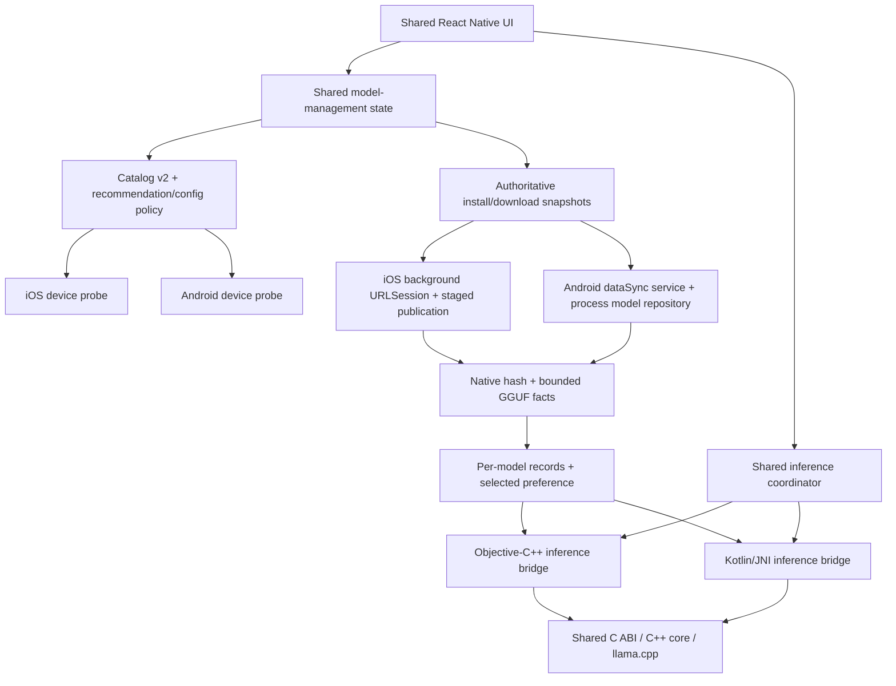
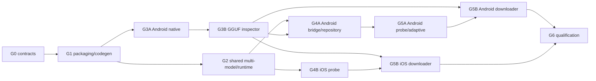

# PocketLM iOS + Android expansion — consolidated implementation plan

Status: approved for Gate 0 orchestration. No expansion feature implementation
has started.
Plan date: 2026-08-07. Repository basis: `6f9de4a`.

This plan consolidates and sequences:

- `2026-07-28-android-adaptive-expansion.md` (v3);
- `2026-07-28-android-adaptive-expansion-review.md`;
- `2026-08-03-ios-adaptive-model-selection.md` (v2); and
- `2026-08-03-ios-adaptive-model-selection-review.md`.

The earlier plans and reviews remain historical inputs. This document owns the
cross-platform delivery order and the implementation-agent orchestration policy.

## Executive decision

Build both platforms as one program: a shared catalog, storage, runtime-policy,
verification, and model-management foundation followed by native Android and iOS
lanes. Do not build two independent model-management stacks.

The implementation-agent allowlist is GPT-5.6-series models plus
`gpt-5.3-codex-spark`. It is not a PocketLM runtime-model restriction. PocketLM
continues to run catalog-pinned GGUF models locally; replacing those with hosted
GPT models would be a separate product and architecture.

Recommended v1.1 product scope:

- Qwen2.5 Instruct 0.5B and 1.5B Q4_K_M, both fully pinned and Apache-2.0;
- per-device advisory recommendation and user override;
- model-specific context and thread defaults;
- host seeding retained as a development/recovery route;
- in-app, resumable, verified installation on iOS and Android;
- Android arm64 CPU inference, with x86_64 used only for CI/emulator coverage;
- iOS recommendation accuracy remains advisory even when device-tested; and
- version 1.1 qualification evidence is model- and configuration-specific.

Deferred until after the two-platform release:

- cross-family or research-licensed models;
- Android Vulkan/OpenCL and new iOS Metal-performance claims;
- automatic performance retuning from noisy benchmark samples;
- Play Store, TestFlight, and App Store publication; and
- production-assistant, factual-reliability, or leak-free claims.

## Decisions to freeze before coding

The plan can proceed with the recommended defaults below, but the decisions must
be recorded in an implementation ADR before their dependent work merges.

| Decision | Recommended default |
| --- | --- |
| Android test target | Name one arm64 phone, Android/API version, RAM, CPU features, and page size |
| Android toolchain | Pin exact JDK distribution/version, SDK platform, build-tools, NDK revision, CMake, Gradle wrapper, and AGP; no `r28+`-style ranges |
| Android identities | App `android.package`, `applicationId`, and app-module namespace: `com.pocketlm.app`; native-library Gradle/Kotlin namespace: `com.pocketlm.nativebridge`; preserve codegen Java package `com.pocketlm` |
| Expo native template | `expo-template-bare-minimum@55.0.27` (the release declaring Expo `~55.0.15` and RN `0.83.4`), fetched by exact tarball URL and verified against its published SHA-512 before `prebuild --template`; never resolve the mutable `sdk-55` tag in a gated build |
| Android CPU packaging | Distinct baseline and dot-product JNI artifacts selected by a baseline-native HWCAP probe; retain a debug force-baseline override. If no dot-product-capable physical target is available, ship baseline-only |
| iOS release meaning | Require Simulator qualification plus one physical-iPhone build and probe/download/load smoke; keep recommendation and Metal claims advisory |
| iOS native packaging | Build Simulator and device artifacts in isolated clean SDK lanes or an XCFramework; never reuse the fixed Simulator archive tree for `iphoneos` |
| Model ladder | Apache-only 0.5B + 1.5B for v1.1; no 3B entry |
| Distribution | Development/sideload artifacts only for v1.1 |
| Native model-path contract | Keep the inference path API, but accept only a canonical path issued for a committed installation; reject traversal, symlinks, and arbitrary JavaScript paths outside an explicit test-only injection path |
| Qualification configuration | Use versioned, per-model fixed qualification profiles for comparable evidence; record the exact values actually passed to load/generate, with a separate adaptive-policy smoke |
| Telemetry | No prompts, generated text, local paths, URLs, validators, or resume blobs |
| Sentry | Preserve the current non-claim unless an RC-only ingestion and symbolication test is explicitly funded |

If no physical iPhone is available, label the iOS result "Simulator-qualified
experimental beta" rather than treating background-transfer behavior as fully
validated.

## Current baseline

- The app is explicitly iOS-only in `app/app.config.ts`; there is no Android
  project, Android bridge, Android CI, or Android model collector.
- The C++17 core and C ABI are reusable, but root CMake does not yet force static
  llama linkage or Android position-independent archives and has no GGUF
  inspection API.
- The Objective-C++ inference bridge already implements the strongest reusable
  lifecycle design: serialized ownership, a dedicated teardown queue, serialized
  delivery, strict request correlation, and join-before-free destruction.
- The model catalog and TypeScript/Ruby validators require exactly one model.
  Manifest schema 1 stores global selection inside the single installation
  record.
- The inference coordinator hardcodes `contextSize: 2048` and `nThreads: 0` and
  does not key a live session by a model/configuration fingerprint.
- Model acquisition and full authentication are host-driven. There is no device
  probe, in-app downloader, native catalog reader, process-lifetime model
  repository, or startup repair pass.
- The iOS pod and release verifier are Simulator-focused. The release verifier
  builds but does not run an iOS XCTest lane.
- The current checkout path contains spaces, while the iOS release verifier
  rejects such a path. Implementation worktrees must live under a no-space
  parent before release verification begins.

## Target architecture



The inference event protocol remains unchanged. Device probes and model
management use sibling native modules so download state and platform capability
do not expand the frozen inference module unnecessarily.

## Delivery order and gates

### Gate 0 — baseline, scope, and contract freeze (4–7 days)

Active control artifacts:

- `docs/implementation-logs/GATE_0_ORCHESTRATION.md`;
- `docs/implementation-logs/GATE_0_BASELINE.md`; and
- `docs/contracts/EXPANSION_GATE_0_CONTRACTS.md`; and
- `docs/implementation-logs/GATE_0_INDEPENDENT_REVIEW.md`.

Deliverables:

- commit the approved plan and its reviewed ADRs;
- create no-space implementation worktrees;
- capture the existing fast, native Debug/Release/ASan, TSan, bridge-harness,
  model-backed, and clean iOS build results;
- freeze the exact Android toolchain/device matrix and the iOS qualification
  scope;
- freeze catalog v2, installation-record v2, selected-preference, download
  snapshot, model/config fingerprint, and mutation-state schemas;
- freeze separate selection semantics: `selectedPreference` is durable user
  intent and never implies a loaded session; `activeFingerprint` is runtime-only
  and exists only after successful native load;
- freeze the platform-native model-lease contract: inference holds a read lease
  on its canonical installed path, while publish/delete/replace requires an
  exclusive lease that cannot be lost by a React reload;
- define native module APIs for probe and model management, including stable
  error/state enums;
- record the protocol amendment and ABI-versioning rules;
- preflight exact worker availability for the user-provided
  `gpt-5.3-codex-spark` selector without substituting `gpt-5.3-codex`; and
- choose the iOS Simulator/device packaging mechanism and make qualification
  profile authority explicit.

Exit gate:

- every baseline result is recorded, with pre-existing failures explicitly
  separated from expansion work;
- schemas have golden valid/invalid fixtures and ownership/lifetime notes; and
- no implementation task is blocked on an unnamed device, version, state, or
  API contract.

### Gate 1 — packaging and codegen foundation (1.5–2.5 weeks)

This is serialized work with one owner.

Deliverables:

- force `BUILD_SHARED_LIBS=OFF` at root CMake and keep all current host/iOS
  suites green;
- enable explicit position-independent static archives for Android JNI linkage
  and force unused GPU/BLAS backends off for Android;
- move `NativePocketLM.ts` and `codegenConfig` into one local autolinked native
  workspace package named `@pocketlm/native`; retain an app-level re-export
  shim, the TurboModule name `PocketLM`, codegen Java package `com.pocketlm`, and
  iOS pod name `PocketLMNative`; use `com.pocketlm.nativebridge` for the Android
  library/Kotlin implementation namespace;
- add minimal Android app/config and local-package scaffolding sufficient to run
  Android prebuild/codegen, while deferring the real Kotlin module to Gate 4A;
- add one repository prebuild entry point that verifies the pinned Expo template,
  passes it explicitly to `expo prebuild`, reapplies the Gradle 8.13 distribution
  and checksum from a verified Gradle 8.13 tool, and asserts the API/NDK/CMake,
  package/namespace, and ABI pins after every clean generation;
- preserve the current iOS pod and generated `PocketLMSpec` contract, and add a
  clean `iphoneos` packaging/build lane using the Gate 0 mechanism;
- add a prebuild-safe generic XCTest target/scheme that runs the existing bridge
  harness wrapper and survives two clean prebuilds; Gate 4B extends this lane
  with probe-specific integration tests rather than recreating it;
- create homes for the sibling probe and model-manager specs; and
- add build-time canonical catalog copying/digest checks so JavaScript, Ruby,
  Objective-C++, and Kotlin all consume identity derived from
  `models/catalog.json`.

Exit gate:

- two consecutive clean iOS and Android prebuilds produce exactly one generated
  inference spec; iOS still registers exactly one working `PocketLM`, while
  Android registration remains an explicit Gate 4A exit condition;
- both Android generations use the exact template tarball and reproduce Gradle
  8.13, NDK `28.2.13676358`, SDK CMake `3.31.6`, API 36, and
  `com.pocketlm.app` without manual edits;
- the stock/generated `AppDelegate.swift` remains unchanged;
- the iOS bridge harness, `xcodebuild test` on the durable generic XCTest lane,
  clean Simulator build, and clean device-SDK build pass without sharing
  SDK-specific native outputs; and
- native catalog resources are byte/schema checked against the repository
  source of truth.

### Gate 2 — shared multi-model and runtime foundation (2–2.5 weeks)

Land N-entry readers and migration before activating the second catalog entry.

Deliverables:

- catalog v2 with uniqueness and safe-path validation for IDs, directories,
  source filenames, and installed paths;
- immutable per-model installation records plus a separate selected-model
  preference;
- atomic, idempotent manifest v1→v2 migration preserving the existing 0.5B
  installation without redownload;
- deterministic fallback for missing, invalid, deleted, or unknown selections;
- model-ID addressing in Ruby, fetch, Simulator seed, and Android seed interfaces;
- pure shared recommendation/runtime-config policy with byte units, caps,
  boundary vectors, persisted manual override, and safe missing-probe fallback;
- model/config fingerprinting in inference ownership;
- a shared switch controller that is a client of the platform-native lease
  authority, with explicit transitions:
  - idle selection commits `selectedPreference` after a durable verified install
    and leaves `activeFingerprint` null;
  - active switching stages desired selection/config → cancel → awaited unload →
    load, then commits both values only after success;
  - installing an unselected model publishes only its installation record; and
  - failed new load keeps the old preference, attempts to reload the old
    fingerprint, and otherwise enters an explicit unloaded error state; and
- per-model bench and qualification identity.

Only after those changes are green, add the fully pinned Qwen2.5 1.5B entry.

Exit gate:

- catalog and manifest golden fixtures agree in every implemented language;
- migration is idempotent and preserves a real schema-1 fixture;
- model/context changes cannot leave two app-owned sessions resident at the JS
  policy layer; native/reload-proof exclusion is accepted only at the later
  platform lease gates;
- failed unload retains old ownership, while failed new load does not publish a
  false `activeFingerprint` and exercises the rollback/error path;
- the resolved model path, context, accelerator, GPU layers, and thread count
  reach their correct native calls; and
- all existing iOS and shared suites remain green.

### Gate 3A — Android native toolchain and CPU packaging (3–5 days)

May overlap Gate 2 after Gate 1's root CMake change lands.

Deliverables:

- exact Android/JDK/SDK/NDK/Gradle/AGP pins and dependency verification;
- x86_64 CI/emulator build plus arm64-v8a release builds;
- arm64 baseline and dot-product artifacts with explicit filenames/SONAMEs;
- a tiny baseline-native `getauxval(AT_HWCAP)`/`HWCAP_ASIMDDP` selector, never
  a `/proc/cpuinfo` guess;
- PIC/static-link and approved dynamic-dependency closure checks;
- Android-native smoke/test runner; and
- 16 KB ELF alignment checks where a loadable ELF exists.

Exit gate:

- x86_64 smoke runs on a KVM-backed AVD;
- baseline arm64 smoke runs on the chosen phone;
- optimized smoke is required on dot-product-capable physical hardware after
  HWCAP confirmation; if that target is unavailable, omit the optimized artifact
  from the release instead of shipping it unexecuted;
- forced-baseline mode works; and
- no Metal, Vulkan, OpenCL, or unintended BLAS backend is compiled.

Gate 3A defines the packaged-runtime assertions; Gate 4A must later prove that
both arm64 libraries coexist in the APK, neither is eagerly loaded through
autolinking/SoLoader, exactly one variant registers JNI, unsupported hardware
cannot select dot-product code, and the force-baseline override uses the same
production registration path.

### Gate 3B — shared native GGUF inspector (3–5 days)

Gate 3A must land first because both touch root native build configuration. Gate
3B may overlap the tail of Gate 2, but it must be frozen before the Android
bridge becomes a new ABI consumer.

Deliverables:

- a versioned C ABI function returning bounded, typed GGUF facts rather than
  accepting a path with unknowable catalog expectations;
- explicit output struct size/version, buffer ownership, truncation, overflow,
  invalid UTF-8, and maximum-template semantics;
- catalog-agnostic golden inspection facts that platform adapters will compare
  with their bundled selected entry; and
- C/C++ header-compile and hostile fixture coverage.

Exit gate:

- valid, truncated, corrupt, oversized-metadata, and structurally valid but
  wrong-metadata/chat-template GGUFs are distinguished correctly;
- verification does not require constructing a model session; and
- Debug/ASan, Release, and applicable concurrency lanes remain green.

### Gate 4A — Android bridge and deterministic provisioning (3–4 weeks)

This is a GPT-5.6 Sol-owned critical-path milestone.

Deliverables:

- Kotlin TurboModule plus JNI adapter matching Inference Protocol v2;
- three execution contexts: lifecycle owner thread, dedicated blocking teardown
  executor, and serialized event-delivery executor;
- JavaVM attach/detach policy, global-reference lifetime, pending-exception
  checks, and React-context invalidation rules;
- strict UTF-16↔UTF-8 conversion for prompts, paths, error strings, and token
  bytes; reject lone surrogates and embedded NULs;
- canonical native resolution of internal
  `filesDir/PocketLM/Models/<appDirectoryName>` paths;
- a process-lifetime Kotlin `ModelRepository`/lease authority shared by
  inference, staged installation, selection, deletion, and startup repair;
- Kotlin comparison of Gate 3B's bounded facts with the canonical bundled
  catalog, including wrong-model and oversized-field cases;
- a portable ABI-level bridge fake and CheckJNI instrumented harness;
- Android app configuration, no-credentials Sentry behavior, and backup rules;
- minimal deterministic fixture seeding followed by a hardened
  `seed-android-model.sh`; and
- debug APK per-`.so` and `zipalign -c -P 16 -v 4` gates.

Exit gate includes rejection/no-event semantics, token contiguity/coalescing,
emoji in prompts and output, malformed input, cancel in every phase,
terminal-before-unload-resolution, no callback after destroy, module reload,
and one session progressing while another teardown blocks. It also requires:

- two clean Android prebuilds with exactly one registered `PocketLM` module;
- both arm64 variants packaged, neither eagerly loaded, exactly one registered
  at runtime, HWCAP-safe normal dot-product selection plus production-path
  force-baseline coverage on the same capable device (or a proven baseline-only
  release when no optimized artifact ships);
- traversal, symlink, arbitrary-JavaScript-path, and uncommitted-install path
  rejection outside an explicit test-only injection route; and
- fixture-seeded chat, cancel, regenerate, and unload on the named arm64 phone
  before repository/downloader work starts.

### Gate 4B — iOS probe and Simulator integration (5–8 days)

May run in parallel with Gate 4A after Gate 1 codegen ownership is stable and
Gate 2's policy contract is frozen.

Deliverables:

- sibling `PocketLMDeviceProbe` TurboModule exposing physical and available
  memory, processor counts, free disk, and `isSimulator`;
- `availableMemoryBytes == 0` means unknown, with advisory physical-memory
  fallback;
- no model choice is hidden or blocked by the advisory probe;
- injected pure-policy tests plus probe integration tests added to Gate 1's
  durable iOS Simulator XCTest target/lane;
- model-aware benchmark attribution; and
- validation copy that does not turn Simulator host memory into a device claim.

Exit gate:

- actual Simulator integration proves `isSimulator == true` and exercises the
  zero/unknown path;
- two clean prebuilds followed by `xcodebuild test` prove the extended test lane
  remains durable;
- absent/malformed probe data fails safely;
- policy boundary vectors pass; and
- the resolved session configuration reaches `loadModel`.

### Gate 5A — Android probe and adaptive integration (1–1.5 weeks)

Deliverables:

- a platform probe for total RAM, low-RAM classification, CPU topology, and
  documented fallbacks when cpufreq facts are missing/zero/offline;
- integration with Gate 4A's process-lifetime repository, with an explicit
  in-process service policy or OS/file lock if a separate process is ever
  introduced; and
- shared policy and switch-controller integration.

Exit gate:

- recommendation boundaries and manual overrides pass deterministically;
- model/context switching is serialized and never double-loads;
- provider/React reload cannot lose the native mutation authority; and
- the named phone reports plausible RAM, low-RAM classification, HWCAP,
  topology/fallback, and resulting model/thread/context recommendation before
  thresholds are described as qualified.

### Gate 5B — parallel platform download engines

Estimate: 2–3 calendar weeks with two senior owners; 4–6 engineer-weeks.

Both implementations conform to one shared snapshot/state contract. Progress
events are hints; snapshots are authoritative.

Android deliverables:

- foreground `dataSync` service after revalidating the frozen API matrix,
  including merged-manifest checks for both foreground-service permissions and
  service type, visible-state start restrictions, timely `startForeground`,
  Android 13 notification-denied behavior, and Android 15 timeout/quota paths;
- exact `Range`/`If-Range` behavior for 206, ignored-range 200, 416, shifted
  ranges, validator changes, and stale/corrupt partials;
- persisted start/pause/resume/cancel/delete/snapshot states and stable errors;
- closed-file hash and native metadata inspection;
- repository-fenced publication and deletion; and
- notification-denied, forced-timeout, Doze, service restart, React reload, and
  process-death tests.

iOS deliverables:

- background `URLSession` with a stable identifier and opaque
  `resumeData`-primary recovery;
- durable model identity, original pinned URL, validators, expected size/hash,
  resume blob, state, and errors—but no invented owned partial length;
- clean restart on invalid resume data, validator mismatch, 416, or expired
  signed-redirect 403;
- prebuild-safe `ExpoAppDelegateSubscriber` handoff with exactly-once completion;
- streamed native CommonCrypto hash and native catalog comparison;
- Objective-C++ adapter rejection coverage for wrong model identity,
  metadata/template mismatch, oversized/truncated facts, and catalog-version
  drift;
- an iOS process-lifetime model-lease registry shared with the inference bridge:
  load holds a canonical-path read lease through destroy, while publication,
  replacement, and deletion require an exclusive lease;
- an `awaitingPublication` state: background work may stage/hash/verify, but
  final promotion waits for foreground cancel + awaited unload instead of
  racing the inference bridge; and
- explicit pause via cancel-producing-resume-data, distinct permanent cancel
  that discards resume/staging state, idempotent repeated pause/resume/cancel,
  missing-resume-data recovery, and relaunch-after-cancel behavior;
- documented file-protection class, restrictive permissions, backup exclusion,
  and cleanup for resume blobs, snapshots, validators/redirect data, and staged
  GGUFs—not only the final installed model; and
- explicit tests for suspension, OS termination/relaunch, and ordinary
  relaunch; no unverified claim about continuation after user force-quit.

Shared durable-publication requirements:

This directory-generation protocol supersedes any file-by-file promotion
sequence in the historical Android or iOS input plans.

1. build one complete operation-scoped generation directory under the native
   same-volume staging root;
2. write/close/hash/inspect/fsync `model.gguf` there;
3. apply and verify restrictive permissions plus the platform file-protection
   and backup-exclusion policy before the record may assert exclusion;
4. write/fsync/rename `manifest.json` inside that staging generation;
5. write/fsync/rename `commit.json` last, then fsync the staging generation and
   its parents;
6. prepare/fsync an empty model-specific rollback parent and reject promotion if
   an unresolved rollback already exists;
7. acquire the platform mutation authority and await unload when required;
8. when replacing, atomically rename the entire current active generation to its
   publication-ID rollback path and fsync both parents;
9. atomically rename the entire complete staged generation to the fixed active
   model-directory path and fsync the model root;
10. reopen and revalidate identity, record/marker, permissions, protection, and
    backup exclusion, then expose the committed snapshot; individual model,
    manifest, and marker files are never promoted independently;
11. if rename, post-rename fsync, or revalidation fails, atomically quarantine
    the candidate active directory and fsync its parents, then restore/fsync the
    rollback generation before returning failure; with no prior generation the
    model remains missing. After a crash, repair restores a lone valid rollback,
    retains a valid promoted active generation, and fails closed on ambiguity;
12. retire rollback only after the new active generation is durably visible and
    revalidated;
13. during an active-session switch, commit selected preference and active
    fingerprint only after the new load succeeds. With no live session,
    preference may commit after durability but must not claim the model is
    loaded; and
14. run startup repair against every staged/active/rollback crash prefix before
    model-manager mutation becomes ready.

Exit gate:

- unverified/partial files are never loadable;
- kill-at-staging, active-to-rollback, and staging-to-active windows repair
  deterministically without mixing publications or losing the prior committed
  generation;
- delete/replace cannot race a loaded or loading session;
- background completion or React reload cannot bypass either platform's live
  model lease and publish over a loaded model;
- the production iOS bridge rejects traversal, symlinks, arbitrary JavaScript
  paths, and uncommitted installations while retaining an explicit test-only
  injection route;
- insufficient-space and all documented resume cases fail closed;
- iOS backup-exclusion `check` passes against an app-downloaded install;
- protected transient iOS download state is also excluded/cleaned as specified;
  and
- an Android compliance test covers every manifest/runtime foreground-service
  rule in the frozen API matrix.

### Gate 6 — product integration and cross-platform qualification (1–2 weeks)

Deliverables:

- models screen for recommendation, override, per-model status, download,
  pause/resume/cancel, delete, disk use, and warnings;
- selected model/config identity in chat, bench, diagnostics, and qualification;
- versioned fixed qualification profiles per model, with artifacts asserting the
  exact session/generation values passed to native; adaptive-policy results are
  recorded as a separate smoke rather than mixed with comparable benchmarks;
- Android qualification collector and platform-specific evidence;
- a release-candidate aggregator including TSan and real-model suites that the
  current release verifier omits;
- synchronized app version, iOS build number, and Android version code; and
- README, architecture, protocol, toolchain, troubleshooting, validation,
  implementation-log, and independent-verification-log updates.

Final acceptance:

- Android: clean signed arm64 sideload → probe → recommend/select → download →
  verify → install → chat/cancel/regenerate/unload on the named phone;
- Android release APK: intended arm64 variants only, approved dynamic closure,
  every packaged `.so` aligned, `zipalign -c -P 16 -v 4` passing, and execution
  on a 16 KB image/device;
- iOS: clean install → probe → recommend/select → download → verify → publish →
  chat/cancel/regenerate/unload under the approved Simulator/device scope;
- iOS physical scope, when selected: clean Simulator and `iphoneos` builds from
  isolated native outputs before the signed-device smoke;
- both 0.5B and 1.5B are independently identified and qualified;
- all platform and shared contract suites pass from clean worktrees;
- release artifacts contain only intended ABIs and native dependencies; and
- validation claims remain bounded to the evidence actually collected.

## Dependency and parallelization map



Do not parallelize changes to:

- codegen ownership, generated native projects, or lockfiles;
- catalog-version activation and manifest migration;
- the C ABI version/signature and both platform consumers;
- the mutation/switch state machine;
- shared model-management snapshot/state interfaces;
- final versioning, model pins, licensing, and release claims; or
- merge-conflict resolution in shared files.

After contracts are frozen, Android/iOS probes, platform harnesses, native
download engines, and platform documentation can proceed in separate worktrees.

## GPT-5.6 / Codex-Spark orchestration policy

Official OpenAI guidance describes GPT-5.6 Sol as the flagship complex-work
model and Terra as the balanced tier. Official Codex material describes
Codex-Spark as a faster, less-capable mode for small, focused coding iterations
and shows the `gpt-5.3-codex-spark` label in a Codex use case, but a public API
model page for that exact selector was not established during this review. Treat
it as the user's requested Codex worker label and verify availability in Gate 0.
Do not substitute the separately documented `gpt-5.3-codex` API model.

Sources: [OpenAI GPT-5.6 model guidance](https://developers.openai.com/api/docs/guides/latest-model),
[Codex granular UI use case](https://learn.chatgpt.com/use-cases/make-granular-ui-changes),
and [GPT-5.3-Codex model page](https://developers.openai.com/api/docs/models/gpt-5.3-codex).

| Role | Allowed model | Work |
| --- | --- | --- |
| Root orchestrator | `gpt-5.6-sol`, high by default | Contract freeze, task graph, integration order, merge decisions, risk/evidence audit |
| Critical designer/implementer | `gpt-5.6-sol`, high/xhigh | C ABI, JNI/iOS lifetime, mutation authority, crash recovery, security, final review |
| Bounded implementation worker | `gpt-5.6-terra`, medium/high | Tooling, TypeScript/Ruby refactors, probes, CI, fixtures, platform work behind frozen interfaces |
| Fast micro-edit worker | `gpt-5.3-codex-spark` | One small UI/copy/fixture/test edit with an explicit file allowlist and immediate verification |

Rules:

1. No worker outside the allowlist may be selected, and no unavailable model is
   silently replaced. If the exact Spark worker is unavailable, use GPT-5.6
   Terra for the same bounded task or leave it queued.
2. Spark never owns JNI/Objective-C++ lifetime, ABI evolution, storage
   migration, hashing/verification, download recovery, licensing, signing,
   security review, or final approval.
3. Run at most three worker lanes plus the root orchestrator. One worker owns a
   subsystem at a time.
4. Every task packet states objective, prerequisites, allowed files, forbidden
   contract changes, invariants, required tests, evidence format, and escalation
   conditions.
5. The implementer cannot be the independent verifier. A GPT-5.6 Sol reviewer
   signs off every contract/concurrency/storage milestone; Terra may independently
   verify bounded low-risk work.
6. Two failed repair attempts, an unexpected shared-interface change, a native
   lifetime ambiguity, or a migration/recovery discrepancy escalates to Sol.
7. The orchestrator alone integrates shared branches, resolves conflicts, and
   updates the dependency graph. Platform workers rebase only after a shared
   gate is accepted.
8. Each milestone records an implementation log and an independent verification
   log before its branch is eligible to merge.

Recommended branch/worktree shape:

```text
codex/expansion-contracts
codex/expansion-foundation
codex/android-native
codex/android-bridge
codex/ios-probe
codex/shared-verifier
codex/android-download
codex/ios-download
codex/expansion-qualification
```

Use squashable milestone PRs, never one long-lived all-platform branch. Keep
generated project and dependency-lock changes with the milestone that owns them.

## Verification cadence

Every PR:

- TypeScript, lint, Jest, Ruby/shell fixtures;
- affected C/C++ Debug/Release and header tests;
- platform-native deterministic harnesses;
- existing iOS build until Android exists, then both clean platform builds;
- catalog/manifest golden conformance; and
- independent diff review against the task packet.

Scheduled/nightly or release-candidate:

- TSan and sanitizer stress;
- real 0.5B/1.5B model verification and inference;
- x86_64 AVD CheckJNI instrumentation;
- Android physical arm64 and 16 KB image/device checks;
- iOS background-session lifecycle/device smoke when authorized;
- download mock-server and process-kill recovery matrix; and
- per-model qualification collection.

Large GGUFs must come only from pinned, SHA-verified caches and must never be
committed or uploaded as ordinary CI artifacts.

## Security, privacy, and observability constraints

- Treat the embedded catalog as release-signed identity: immutable HTTPS URL,
  exact byte size/SHA-256, bounded GGUF metadata, license, and safe paths.
- Store models only in platform-internal application storage and exclude them
  from backup using platform-appropriate, tested mechanisms.
- Never log or send prompts, generated text, model paths, download/resume URLs,
  HTTP validators, resume blobs, signing material, or device identifiers.
- Allowed coarse telemetry: model ID, catalog/ABI/protocol versions, platform,
  selected configuration, byte counts, durations, terminal enum, download state,
  and coarse memory/throughput facts.
- Never commit signing keys, Sentry credentials, model files, device identifiers,
  or raw qualification traces.
- Revalidate current Android background-service and iOS background-session
  requirements from primary platform documentation when those milestones begin.

## Estimate

The consolidated scope is approximately 16–24 engineer-weeks, including the
listed independent verification and physical-device packaging but excluding
cross-family models and store publication. With the shared foundation landed
first, then three bounded worker lanes plus the orchestrator, expected elapsed
time is approximately 10–16 calendar weeks. Hardware access, Expo/codegen
integration, or background-transfer failures can extend the critical path.

The implementation is not complete when code compiles. It is complete when the
two clean-install journeys pass, the existing inference lifecycle contract still
holds, migration/recovery is proven, and the documentation states only claims
supported by platform-specific evidence.
